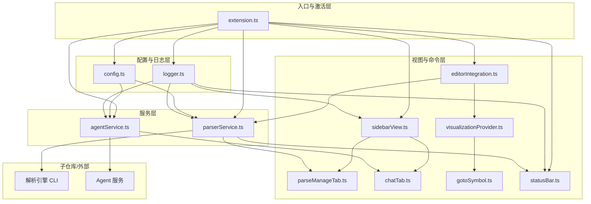

# 主仓库：详细功能与架构设计

本文档对主仓库（VSCode 扩展）做实现级拆解，每个模块或紧密相关的文件组以 **约 500-800 行代码** 为粒度，便于分工与估量。与 [扩展架构与集成.md](扩展架构与集成.md)、[命令与视图清单.md](命令与视图清单.md) 配套使用。

---

## 1. 概述与设计原则

### 1.1 主仓库职责回顾

- **扩展清单**：`package.json` 的 contributes（命令、视图、菜单、配置、extensionKind）。
- **激活与生命周期**：扩展激活时初始化配置、日志、服务与视图；使用扩展内打包的解析引擎可执行体，无需用户配置路径或单独安装。
- **集成**：协调三个子组件——调用解析引擎（CLI）、加载侧边栏与编辑区 UI、与 Agent 服务（stdio/socket/HTTP）通信。
- **Remote-SSH**：扩展在远程扩展主机运行，解析引擎/DB/Agent 在远程主机执行，UI 与消息通道由 VSCode 远程机制透明处理，行为与本地一致。

### 1.2 粒度约定

- **单模块**或**紧密相关的少量文件**合计约 **500-800 行**（TypeScript/HTML/CSS 等），便于单人单任务实现与单元/集成测试。
- `extension.ts` 仅做注册与委托，具体逻辑落在 config、logger、services、views、editor、statusBar 等模块，保证单文件可控制在合理行数内。

### 1.3 技术栈

- **语言**：TypeScript；VSCode Extension API。
- **解析引擎**：随扩展打包，主仓库从 `context.asAbsolutePath` 取当前平台二进制路径，无 parserPath 配置。
- **Agent**：通过配置的 endpoint（stdio / Unix socket / HTTP）连接，协议见 [03-Agent模块/接口与协议.md](../03-Agent模块/接口与协议.md)。
- **UI**：侧边栏为 Webview 内双标签（解析管理 / AI 对话）；编辑区可视化为 Custom Editor 或 Webview 作为编辑器 Tab；所有按钮使用 VSCode 图标（Codicon/ThemeIcon）。

---

## 2. 架构总览与分层

### 2.1 分层与依赖（示意）



### 2.2 建议目录结构

```
src/
  extension.ts              # 入口、activate，注册命令/视图/菜单
  config.ts                 # 配置读取与路径解析（工作区、DB、解析器二进制、Remote 适配）
  logger.ts                 # 日志：输出通道 + 可选落盘，按模块/级别
  types.ts                  # 共享类型（配置项、查询类型、Agent 消息格式等）
  services/
    parserService.ts        # 解析引擎 CLI：parse、query、list-runs，进度回调
    agentService.ts         # Agent 连接、chat、流式回复、session_id
  views/
    sidebarView.ts          # 侧边栏容器与双标签（解析管理 / AI 对话）
    parseManageTab.ts       # 解析管理标签页逻辑（与 Webview 消息、按钮/历史）
    chatTab.ts              # AI 对话标签页逻辑（与 Webview 消息、发送/流式展示）
    visualizationProvider.ts # 编辑区「图」标签：接收 type+data，渲染图/树，节点点击 goto 代码
  editor/
    editorIntegration.ts    # 编辑器右键菜单、当前符号、query* 命令注册与执行
    gotoSymbol.ts           # codexray.gotoSymbolInEditor：showTextDocument + revealRange
  statusBar.ts              # 解析进度百分比状态栏
resources/                  # 可选：侧边栏/可视化 Webview 的 HTML/JS/CSS
  sidebar.html
  graph.html
```

---

## 3. 模块清单与预估行数

| 模块 | 职责概要 | 主要文件 | 预估行数 | 依赖 | 命令/视图/配置对应 |
|------|----------|----------|----------|------|-------------------|
| 扩展入口与激活 | 注册命令/视图/菜单，初始化 Config/Logger，创建 ParserService/AgentService，注册侧边栏与状态栏 | extension.ts, 部分 sidebarView.ts | 400-600 | config, logger, services, views | 所有命令 ID、视图 ID、menus、activationEvents |
| 配置与路径 | 读取 contributes 配置项，工作区根、DB 路径、解析器可执行体路径（context.asAbsolutePath），Remote 适配 | config.ts | 300-500 | - | codexray.* 配置键 |
| 日志 | 输出通道 + 可选落盘，logLevel，每函数日志约定 | logger.ts | 200-400 | - | codexray.logLevel, codexray.logPath |
| 解析引擎服务 | 构建 parse/query/list-runs CLI 参数，spawn 子进程，解析 stdout 进度 JSON，返回摘要/历史/查询 JSON | services/parserService.ts | 500-800 | config, logger | codexray.runParse, codexray.listParseHistory, codexray.query* |
| Agent 服务 | 连接 Agent（stdio/socket/HTTP），发送 chat（含 context），接收流式/一次性回复，session_id | services/agentService.ts | 500-800 | config, logger | codexray.openAIChat，AI 对话标签页 |
| 侧边栏容器与双标签 | 注册侧边栏视图，单 Webview 内双标签（解析管理 / AI 对话），标签切换，与 parseManageTab/chatTab 消息 | views/sidebarView.ts + 可选 resources/sidebar.html | 500-700 | config, parserService, agentService | 视图 CodeXray 侧边栏、CodeXray·解析管理、CodeXray·AI 对话 |
| 解析管理标签页 | 工程路径/compile_commands 展示与设置，解析/历史按钮，历史列表，postMessage 触发 runParse/listParseHistory | views/parseManageTab.ts + Webview UI | 500-800 | parserService, config | codexray.openProject, codexray.setCompileCommands, codexray.runParse, codexray.listParseHistory |
| AI 对话标签页 | 输入框、发送、历史消息、引用当前符号，postMessage 发消息，接收扩展转发的 Agent 流式回复 | views/chatTab.ts + Webview UI | 500-800 | agentService | codexray.openAIChat |
| 编辑器集成 | 当前文档与光标/选区，解析符号，注册编辑器右键与 query* 命令，触发查询并打开可视化标签 | editor/editorIntegration.ts | 400-600 | config, parserService, visualizationProvider | codexray.queryCallGraph/ClassGraph/DataFlow/ControlFlow，editor/context 菜单 |
| 可视化编辑区标签 | 接收 type+data，编辑区新标签渲染图/树，节点点击 postMessage 触发 gotoSymbolInEditor | views/visualizationProvider.ts + 可选 resources/graph.html | 600-800 | logger | codexray.focusVisualization，customEditors 或 commands 打开 |
| 定位到代码 | codexray.gotoSymbolInEditor(uri, line, column)：showTextDocument + revealRange | editor/gotoSymbol.ts | 100-300 | - | codexray.gotoSymbolInEditor |
| 状态栏 | StatusBarItem，解析进度百分比（从 ParserService 进度回调更新），完成/失败态 | statusBar.ts | 200-400 | parserService, logger | 状态栏 codexray.parseProgress |

---

## 4. 各模块详细设计

### 4.1 扩展入口与激活

- **功能**：`activate()` 中创建 Config、Logger，注册所有命令与视图，创建 ParserService、AgentService、SidebarView、EditorIntegration、StatusBar、VisualizationProvider、GotoSymbol；将服务与视图互相注入。不承担具体业务逻辑，仅组装与注册。
- **公开 API**：无对外导出；`activate(context: vscode.ExtensionContext)` 与 `deactivate()` 由 VSCode 调用。
- **关键实现要点**：按「配置 → 日志 → 服务 → 视图 → 命令」顺序初始化；命令实现委托给对应模块（如 runParse 调用 parserService.parse()）；extensionKind 声明为 `["ui", "workspace"]` 或 `["workspace"]` 以支持 Remote-SSH。
- **预估行数**：400-600（含 extension.ts 与 sidebar 注册部分）。
- **引用**：[扩展架构与集成](扩展架构与集成.md) 第 4 节；[命令与视图清单](命令与视图清单.md)。

### 4.2 配置与路径

- **功能**：读取 workspace 与 global 的 codexray.* 配置；解析工作区根路径、DB 路径（默认 .codexray/codexray.db）、compile_commands 路径；解析器可执行体路径从 `context.asAbsolutePath('bin/codexray-parser')` 或按平台取（如 .exe）；getParserOptions() 返回 parallelism、lazy、priorityDirs、incremental。不负责写配置或弹窗。
- **公开 API**：`getWorkspaceRoot(): Uri | undefined`、`getDatabasePath(): string`、`getCompileCommandsPath(): string`、`getParserPath(): string`、`getParserOptions(): ParserOptions`、`getAgentEndpoint(): string`、`getLogLevel(): string`、`getLogPath(): string | undefined`；可选 `init(context)` 注入 context。
- **关键实现要点**：工作区根用 `vscode.workspace.workspaceFolders?.[0]?.uri`；路径均基于当前工作区以支持 Remote；解析器路径随扩展打包，无需用户配置。
- **预估行数**：300-500。
- **引用**：[命令与视图清单](命令与视图清单.md) 第 3 节配置键。

### 4.3 日志

- **功能**：创建 OutputChannel「CodeXray」；可选按 getLogPath() 落盘；按 getLogLevel() 过滤；提供 createLogger(moduleName)，各模块在函数入口/出口/错误处打日志。不解析或存储业务数据。
- **公开 API**：`createLogger(module: string): { info, debug, warn, error }(msg, ...args)`；可选 `setLogPath(path: string)`。
- **关键实现要点**：每条日志可带时间戳与 module 前缀；落盘时追加写入，避免阻塞；满足「每个函数都要有日志记录运行状态」的规则。
- **预估行数**：200-400。
- **引用**：无子仓库依赖。

### 4.4 解析引擎服务

- **功能**：构建解析引擎 CLI 参数（见 [01-解析引擎/接口约定](../01-解析引擎/接口约定.md)），spawn 子进程执行 parse/query/list-runs；解析 stdout 中的进度 JSON 行并回调 onProgress(percent)；返回解析摘要、历史列表、查询结果 JSON。不负责 UI 展示或 DB 直接读写（DB 由解析引擎写）。
- **公开 API**：`parse(options?: { incremental?: boolean }): Promise<ParseResult>`、`query(type: QueryType, options: { symbol?, file?, ... }): Promise<GraphData>`、`listRuns(limit?: number): Promise<ParseRun[]>`、`onProgress(callback: (percent: number) => void): void`、`dispose(): void`。
- **关键实现要点**：getParserPath() 来自 Config；CLI 参数与接口约定 2.1/2.2/2.3 一致（--project、--output-db、--parallel、--lazy、--priority-dirs、--incremental、--type 等）；进度通过 stdout 逐行解析 JSON 的 percent 字段；query 返回的 JSON 直接可供 VisualizationProvider 使用。
- **预估行数**：500-800。
- **引用**：[01-解析引擎/接口约定](../01-解析引擎/接口约定.md)。

### 4.5 Agent 服务

- **功能**：根据 getAgentEndpoint() 建立与 Agent 的连接（stdio 子进程 / Unix socket / HTTP）；发送 chat 请求（含 session_id、message、context：file/symbol/selection）；接收流式或一次性回复并回调；维护 session_id。不负责聊天 UI 渲染。
- **公开 API**：`connect(): Promise<void>`、`sendChat(message: string, context?: ChatContext): Promise<void>`、`onStreamChunk(callback: (chunk: string) => void)`、`onReply(callback: (full: string) => void)`、`disconnect(): void`、`dispose(): void`。
- **关键实现要点**：协议格式与 [03-Agent模块/接口与协议](../03-Agent模块/接口与协议.md) 一致（action: chat、context、流式 SSE 或 NDJSON）；session_id 可由主仓库生成 UUID 或由 Agent 返回。
- **预估行数**：500-800。
- **引用**：[03-Agent模块/接口与协议](../03-Agent模块/接口与协议.md)。

### 4.6 侧边栏容器与双标签

- **功能**：注册一个侧边栏视图（如 view id 「codexray.sidebar」）；视图中为一个 Webview，Webview 内为两个标签页「解析管理」「AI 对话」的 UI（tab 切换）；将 postMessage 按 action 分发给 parseManageTab 或 chatTab 处理；不实现具体表单或聊天逻辑，只做容器与路由。
- **公开 API**：`createSidebarView(context, parserService, agentService, config): SidebarView`；内部与 parseManageTab/chatTab 通过消息或回调通信。
- **关键实现要点**：推荐单 Webview + 内嵌两个 panel 与 tab 按钮（Codicon）；postMessage 协议约定 action: runParse | listHistory | setProject | setCompileCommands | sendChat | getContext 等；与 [02-可视化界面/UI与交互逻辑](../02-可视化界面/UI与交互逻辑.md) 布局一致。
- **预估行数**：500-700。
- **引用**：[02-可视化界面/UI与交互逻辑](../02-可视化界面/UI与交互逻辑.md) 第 1 节布局约定。

### 4.7 解析管理标签页

- **功能**：在侧边栏「解析管理」标签页内展示：工程路径、compile_commands 路径、解析按钮、历史解析记录列表；用户操作通过 postMessage 通知扩展，扩展调用 parserService.parse/listRuns、config 写入；解析进度与结果通过 message 回传 Webview 更新 UI。不直接 spawn 解析引擎。
- **公开 API**：由 sidebarView 调用或作为消息处理函数注册；对外可暴露 `updateParseProgress(percent)`、`updateHistory(runs: ParseRun[])` 等供 extension 回调。
- **关键实现要点**：按钮使用 Codicon；历史列表展示 run_id、时间、mode、files_parsed、status；与 [命令与视图清单](命令与视图清单.md) 解析相关命令对应。
- **预估行数**：500-800。
- **引用**：[01-解析引擎/接口约定](../01-解析引擎/接口约定.md) 2.3 list-runs。

### 4.8 AI 对话标签页

- **功能**：在侧边栏「AI 对话」标签页内展示：输入框、发送按钮、历史消息列表、可选「引用当前符号」；用户发送时 postMessage 到扩展，扩展调用 agentService.sendChat；Agent 流式回复通过 extension 转发到 Webview，逐 chunk 追加到 UI。不直接连接 Agent。
- **公开 API**：由 sidebarView 调用或作为消息处理函数注册；对外可暴露 `appendReplyChunk(chunk: string)`、`setContext(file, symbol)` 等。
- **关键实现要点**：按钮使用 Codicon；流式更新使用 postMessage 多次发送 chunk；与 [03-Agent模块/接口与协议](../03-Agent模块/接口与协议.md) chat 请求/响应一致。
- **预估行数**：500-800。
- **引用**：[03-Agent模块/接口与协议](../03-Agent模块/接口与协议.md) 3.1 对话。

### 4.9 编辑器集成

- **功能**：获取当前活动编辑器与光标/选区；解析当前符号（可先基于选区文本或简单正则，后续可对接解析引擎符号解析）；注册编辑器右键菜单（when: editorLangId == c/cpp）与 codexray.queryCallGraph/ClassGraph/DataFlow/ControlFlow 命令；命令执行时取符号 → 调用 parserService.query(type, { symbol, file }) → 将返回的 JSON 传给 visualizationProvider.openGraph(type, data)。不负责图的渲染。
- **公开 API**：`registerEditorCommands(context, parserService, visualizationProvider)`；内部实现 getCurrentSymbol(): { name, file, range } | undefined。
- **关键实现要点**：查询主入口在代码编辑区，与 [02-可视化界面/UI与交互逻辑](../02-可视化界面/UI与交互逻辑.md) 第 3 节一致；when 条件保证仅在 C/C++ 文件显示右键菜单。
- **预估行数**：400-600。
- **引用**：[02-可视化界面/UI与交互逻辑](../02-可视化界面/UI与交互逻辑.md) 第 3 节；[命令与视图清单](命令与视图清单.md) 第 4 节菜单。

### 4.10 可视化编辑区标签

- **功能**：根据 type（call_graph/class_graph/data_flow/control_flow）与 data（JSON）在编辑区打开新标签（Custom Editor 或 WebviewPanel），渲染图/树；节点点击时 postMessage 到扩展，扩展调用 gotoSymbol.execute(uri, line, column)。不负责从 DB 查询，只负责接收数据与渲染、交互。
- **公开 API**：`openGraph(type: QueryType, data: GraphData): void`；内部注册 handleMessage('gotoSymbol', payload) 并调用 gotoSymbol。
- **关键实现要点**：与「可视化与代码互相交互」一致；data 结构符合 [01-解析引擎/接口约定](../01-解析引擎/接口约定.md) 第 3 节查询结果；使用 VSCode 图标若图内有操作按钮。
- **预估行数**：600-800。
- **引用**：[02-可视化界面/UI与交互逻辑](../02-可视化界面/UI与交互逻辑.md) 3.1；[01-解析引擎/接口约定](../01-解析引擎/接口约定.md) 第 3 节。

### 4.11 定位到代码

- **功能**：实现命令 codexray.gotoSymbolInEditor：接收参数 uri（或 file path）、line、column；调用 vscode.window.showTextDocument 并 revealRange 定位到该行/列。不解析符号或查询 DB。
- **公开 API**：`execute(uri: vscode.Uri, line: number, column: number): Promise<void>`。
- **关键实现要点**：revealRange 使用 new vscode.Range(line-1, column-1, line-1, column-1) 或适当 range；由可视化 Webview 节点点击触发。
- **预估行数**：100-300。
- **引用**：[命令与视图清单](命令与视图清单.md) codexray.gotoSymbolInEditor。

### 4.12 状态栏

- **功能**：创建 StatusBarItem（如 id codexray.parseProgress）；解析进行中通过 parserService.onProgress 回调更新文案为「CodeXray 解析 N%」；解析完成或失败后更新为「完成」或「解析失败」；不解析或调用解析引擎。
- **公开 API**：`createStatusBar(parserService): StatusBarController`；内部 `updateProgress(percent: number)`、`setDone()`、`setFailed()`。
- **关键实现要点**：必须显示百分比，与 [命令与视图清单](命令与视图清单.md) 第 5 节一致；parserService 在 parse 开始时注册 onProgress，结束时注销或通知完成。
- **预估行数**：200-400。
- **引用**：[命令与视图清单](命令与视图清单.md) 第 5 节状态栏。

---

## 5. 关键数据流

### 5.1 解析流程

1. 用户在侧边栏「解析管理」标签页点击「解析」或执行 codexray.runParse。
2. 扩展侧 parseManageTab 收到消息 → 调用 parserService.parse(options)（options 含 incremental 等来自 config）。
3. ParserService 构建 CLI 参数，spawn 解析引擎子进程；解析 stdout 每行 JSON，提取 percent → 调用 onProgress(percent)。
4. StatusBar 已注册 onProgress，更新为「CodeXray 解析 N%」；可选通过 postMessage 通知解析管理 Webview 更新进度。
5. 子进程退出：0 为成功，非 0 为失败；ParserService 返回 ParseResult；StatusBar 设为「完成」或「解析失败」；解析管理页可刷新历史列表（listRuns）。

### 5.2 查询与可视化流程

1. 用户在 C/C++ 编辑器中右键「查看调用链」或执行 codexray.queryCallGraph（以当前符号为目标）。
2. EditorIntegration 获取当前文档与光标/选区，解析当前符号（name、file、range）；调用 parserService.query('call_graph', { symbol, file })。
3. ParserService 执行 query CLI 或本地 API，返回 JSON（节点+边）；EditorIntegration 调用 visualizationProvider.openGraph('call_graph', data)。
4. VisualizationProvider 在编辑区新建标签（Custom Editor 或 Webview），将 data 注入并渲染图；用户点击图中节点。
5. Webview postMessage({ action: 'gotoSymbol', uri, line, column })；扩展侧 VisualizationProvider 或统一消息处理调用 gotoSymbol.execute(uri, line, column)。
6. GotoSymbol 执行 showTextDocument + revealRange，编辑器定位到对应代码。

### 5.3 AI 对话流程

1. 用户在侧边栏「AI 对话」标签页输入内容并点击发送。
2. Webview postMessage({ action: 'sendChat', message, context? })；扩展侧 chatTab 处理，调用 agentService.sendChat(message, context)。
3. AgentService 将请求发往 Agent 服务（stdio/socket/HTTP）；Agent 返回流式 chunk 或一次性 reply。
4. AgentService 通过 onStreamChunk 回调或 onReply 回调；扩展将 chunk 或 full reply 通过 webview.postMessage 发回「AI 对话」Webview。
5. Webview 将内容追加到聊天历史列表并展示。

### 5.4 Remote-SSH 说明

- ParserService、AgentService、Config 使用的路径与 spawn 均在**当前 Extension Host** 执行。在 Remote-SSH 下，Extension Host 在远程主机，因此解析引擎子进程与 Agent 连接均在远程主机；DB 路径也为远程工作区路径。
- UI（侧边栏 Webview、编辑区标签、状态栏）与消息通道由 VSCode 远程机制透明处理，主仓库无需为远程单独写分支逻辑。

---

## 6. 主仓库内部接口契约（摘要）

便于实现时保持接口稳定；细节见第 4 节各模块。

| 模块 | 主要接口 |
|------|----------|
| Config | getWorkspaceRoot(), getDatabasePath(), getCompileCommandsPath(), getParserPath(), getParserOptions(), getAgentEndpoint(), getLogLevel(), getLogPath() |
| Logger | createLogger(module: string) → { info, debug, warn, error }(msg, ...args) |
| ParserService | parse(options?), query(type, options), listRuns(limit?), onProgress(callback), dispose() |
| AgentService | connect(), sendChat(message, context?), onStreamChunk(fn), onReply(fn), disconnect(), dispose() |
| VisualizationProvider | openGraph(type, data), 内部 handleMessage('gotoSymbol', payload) → gotoSymbol.execute() |
| GotoSymbol | execute(uri: Uri, line: number, column: number) |
| StatusBar | updateProgress(percent), setDone(), setFailed()；由 ParserService 进度回调驱动 |

---

## 7. package.json 与 contributes 要点

- **命令 ID**（见 [命令与视图清单](命令与视图清单.md) 第 2 节）：codexray.openProject, codexray.setCompileCommands, codexray.runParse, codexray.listParseHistory, codexray.queryCallGraph, codexray.queryClassGraph, codexray.queryDataFlow, codexray.queryControlFlow, codexray.openAIChat, codexray.focusVisualization, codexray.gotoSymbolInEditor。
- **视图 ID**：侧边栏一个 view（如 codexray.sidebar），内部双标签由 Webview 自身实现；若需在 contributes.views 中拆成两项（解析管理 / AI 对话）也可，与 sidebarView 注册的 view 对应。
- **配置**：codexray.compileCommandsPath, codexray.databasePath, codexray.parserParallelism, codexray.parserLazy, codexray.parserPriorityDirs, codexray.parserIncremental, codexray.agentEndpoint, codexray.logLevel, codexray.logPath。
- **菜单**：commandPalette；editor/context（when: editorLangId == c 或 cpp）绑定 query* 与「在 AI 对话中引用当前符号」；可选 view 的 contextMenu。
- **extensionKind**：`["ui", "workspace"]` 或 `["workspace"]`，以支持 Remote-SSH。
- **activationEvents**：建议 onView:codexray.sidebar、onCommand:codexray.* 等，或 `*` 按需激活。

---

## 8. 与现有 doc 的对应关系

- 本设计是 [扩展架构与集成](扩展架构与集成.md) 的**细化与实现级拆解**；[命令与视图清单](命令与视图清单.md) 中的每项命令、视图、配置、菜单、状态栏均在本设计中落到具体模块与 API。
- 子仓库接口以 [01-解析引擎/接口约定](../01-解析引擎/接口约定.md)、[03-Agent模块/接口与协议](../03-Agent模块/接口与协议.md) 为准；主仓库不重复定义 CLI 或 Agent 协议，仅说明「主仓库如何调用」。
- UI 布局、查询入口在代码编辑区、可视化与代码互相交互、侧边栏双标签、按钮使用 VSCode 图标等，均以 [02-可视化界面/UI与交互逻辑](../02-可视化界面/UI与交互逻辑.md) 为准；本设计在视图与编辑器集成等模块中引用该文档。
