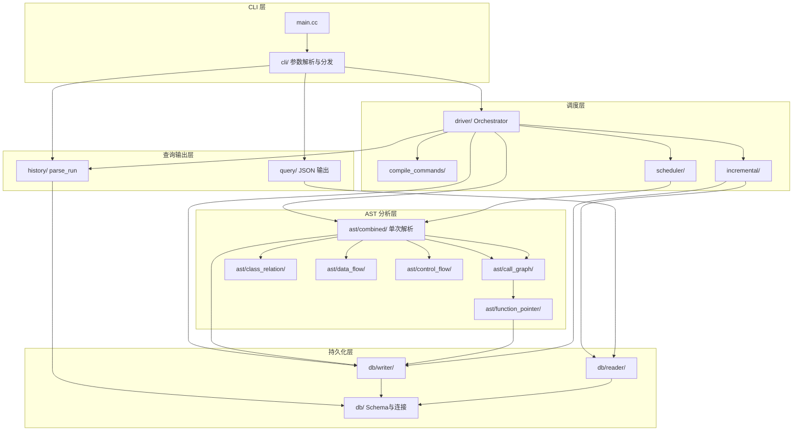

# 解析引擎：详细功能与架构设计

本文档对解析引擎（C++/Clang libtooling）做实现级拆解，每个模块或紧密相关的 .cc/.h 以 **约 500-800 行代码** 为粒度，便于分工与估量。与 [模块功能说明.md](模块功能说明.md)、[接口约定.md](接口约定.md)、[数据库设计.md](数据库设计.md) 配套使用。

---

## 1. 概述与设计原则

### 1.1 解析引擎职责回顾

- **子仓库**：C/C++ 代码解析引擎（如 `codexray-parser`），基于 **Clang libtooling**，依赖 `compile_commands.json` 驱动语义级分析。
- **输出**：函数调用链（含函数指针全调用链）、类关系、全局变量数据流、控制流等结构化结果；所有符号使用 **USR** 标识，并记录**定义位置**与**定义范围**；结果持久化到本地 SQLite，支持高效查询。
- **能力**：并行解析（默认并行度 = 系统核心数，见 §5.6）、懒解析（优先解析目录 + 查询时按需解析剩余）、优先解析目录配置、**增量更新**（仅变更 TU 重解析并合并回 DB）、**历史解析记录**（parse_run 表与 list-runs 接口）。

以上与 [模块功能说明](模块功能说明.md) 第 2 节功能列表及第 3 节实现要点一致。

### 1.2 粒度约定

- 单模块或紧密相关的 **.cc/.h 合计约 500-800 行**，便于单人单任务实现与单元/集成测试。
- Clang AST 访问器因类型与分支较多，单文件可放宽至 **600-900 行**，在模块清单中注明。
- `main.cc` 仅做参数解析与子命令分发，具体逻辑落在 driver、scheduler、ast、db、query、history 等模块。

### 1.3 技术栈

- **语言**：C++17 或 C++20。
- **解析**：Clang libtooling（FrontendAction + RecursiveASTVisitor 或 AST 访问器）；必要时使用 CFG 接口。
- **存储**：SQLite，表结构与 [数据库设计](数据库设计.md) 一致。
- **对外**：CLI 子命令 parse / query / list-runs，参数与输出格式以 [接口约定](接口约定.md) 为准。

---

## 2. 架构总览与分层

### 2.1 分层与依赖（示意）



### 2.2 建议目录结构

```
src/
  main.cc                    # 入口、子命令 dispatch
  cli/                       # 参数解析、parse/query/list-runs 分发、进度 stdout
  driver/                    # 解析驱动：compile_commands、scheduler、AST、DB、history
  compile_commands/          # 加载 JSON、TU 列表、按 priority-dirs 划分
  scheduler/                 # 线程池、TU 队列、懒解析首轮/按需解析触发
  ast/
    call_graph/              # 调用链 FrontendAction + Visitor，委托 function_pointer
    function_pointer/        # 函数指针可能目标分析，多 callee 边
    class_relation/          # 类/结构体、继承/组合/依赖
    data_flow/               # 全局变量、读写点、data_flow_edge
    control_flow/            # CFG 构建
  db/                        # SQLite 连接、schema 创建/迁移、事务
  db/writer/                 # symbol/call_edge/class/global_var/cfg 批量写入
  db/reader/                 # 按 USR/文件/类型查询，支持深度（如 depth=3）
  query/                     # call_graph/class_graph/data_flow/control_flow JSON 输出
  incremental/               # mtime/hash 变更检测、删除旧数据
  history/                   # parse_run 写入、list-runs 读取与 JSON
  common/                    # 日志、错误码、USR/路径工具
```

---

## 3. 模块清单与预估行数

| 模块 | 职责概要 | 主要文件/目录 | 预估行数 | 依赖 | 对应接口约定/数据库设计 | 对应模块功能说明 |
|------|----------|----------------|----------|------|--------------------------|------------------|
| CLI 入口与子命令 | main、参数解析、parse/query/list-runs 分发、进度 stdout 输出 | main.cc, cli/ | 400-600 | driver, query, history | 2.1 解析、2.2 查询、2.3 历史 | 1.1, 1.4, 1.5, 1.6 |
| 解析驱动（Orchestrator） | 读 compile_commands、建 TU 列表、调 scheduler、按 lazy/priority 决定首轮 TU、调各 AST Action、写 DB、写 parse_run | driver/ | 500-800 | compile_commands, scheduler, ast/*, db, incremental, history | 2.1、懒解析/增量 | 1.1, 1.2, 1.5, 1.6, 1.11 |
| CompileCommands 加载 | 解析 JSON、展开路径、输出 TU 列表；按 priority-dirs 划分优先/剩余 | compile_commands/ | 250-450 | common | - | 1.1, 1.6 |
| 并行与懒解析调度 | 线程池、TU 队列、默认 parallel=核心数（§5.6）；懒解析下首轮只跑优先 TU，查询时触发剩余 TU | scheduler/ | 400-600 | common | 2.1 --parallel, --lazy, --priority-dirs | 1.4, 1.5 |
| 调用链 AST | FrontendAction + Visitor：函数 Decl、CallExpr、USR/定义位置/范围、call_edge（direct）；委托函数指针分析 | ast/call_graph/ | 500-800 | db writer, function_pointer | symbol, call_edge；接口约定 §3 调用图 | 1.1, 1.7, 1.8, 1.10 |
| 函数指针分析 | 给定调用点为函数指针时，解析所有可能 callee，写多条 call_edge（edge_type=via_function_pointer） | ast/function_pointer/ | 400-600 | call_graph, db writer | call_edge edge_type | 1.9 |
| 类关系 AST | 类/结构体、基类、成员、class_relation（inheritance/composition/dependency） | ast/class_relation/ | 450-650 | db writer | class, class_relation；接口约定 §3 类图 | 1.1, 1.7, 1.8, 1.10 |
| 数据流 AST | 全局变量、读写点、data_flow_edge | ast/data_flow/ | 400-600 | db writer | global_var, data_flow_edge | 1.1, 1.7, 1.8, 1.10 |
| 控制流 AST | CFG 构建，cfg_node、cfg_edge | ast/control_flow/ | 400-600 | db writer | cfg_node, cfg_edge | 1.1 |
| DB 连接与 Schema | SQLite 打开、表创建/迁移（与数据库设计一致）、事务 | db/, db/schema.cc | 350-550 | common | 数据库设计 §2 | 1.2, 1.3 |
| DB 写入 | symbol/call_edge/class/global_var/cfg 批量插入；按 file 或 run 组织 | db/writer/ | 500-750 | db schema | 数据库设计 §2 | 1.2 |
| DB 读取与查询 | 按 USR/文件/类型查 symbol、call_edge、class、global_var、cfg；支持深度（如默认 3 层） | db/reader/ | 400-600 | db schema | 查询场景 §3 | 1.3 |
| 查询 JSON 输出 | call_graph/class_graph/data_flow/control_flow 四种，组装 definition、definition_range、edge_type 等 | query/ | 450-650 | db reader | 接口约定 §3 输出格式 | 1.3 |
| 增量更新 | 对比 parsed_file 与磁盘 mtime/hash，得到变更文件；删除这些文件在 DB 中旧数据 | incremental/ | 250-450 | db reader/writer | 2.1 --incremental；数据库设计 parsed_file | 1.12 |
| 历史解析记录 | 写 parse_run；list-runs 读 parse_run 输出 JSON | history/ | 200-400 | db | 2.3 list-runs；数据库设计 parse_run | 1.11 |
| 公共（日志/错误码/工具/Clang 环境探测） | 日志落盘、错误码常量、USR/路径辅助、**Clang 头路径自动探测**（clang++ -v / -print-resource-dir，供 LibTooling 注入） | common/ | 250-450 | - | 接口约定 §4 错误码；§5.5 标准库头文件 | - |

---

## 4. 各模块详细设计

### 4.1 CLI 入口与子命令

- **功能**：程序入口；解析命令行参数；根据子命令（parse / query / list-runs）分发到 driver、query、history；解析过程中向 stdout 输出进度 JSON 行（供主仓库轮询），退出码与 [接口约定](接口约定.md) §4 一致。
- **公开接口**：`int main(int argc, char** argv)`；内部调用 `ParseArgs()`、`RunParse()`/`RunQuery()`/`RunListRuns()`；进度格式如 `{"progress": 45, "current_file": "..."}` 每行一个 JSON。
- **关键实现要点**：使用 getopt 或第三方 CLI 库解析 --project、--compile-commands、--output-db、--parallel、--lazy、--priority-dirs、--incremental 等；子命令 dispatch 后不持有 AST 或 DB 句柄，仅调用 driver/query/history 的接口。
- **预估行数**：400-600。
- **引用**：[接口约定](接口约定.md) 2.1、2.2、2.3、§4。

### 4.2 解析驱动（Orchestrator）

- **功能**：协调一次完整解析流程。加载 compile_commands 得到 TU 列表；按 lazy 与 priority-dirs 决定首轮要解析的 TU 集合（懒解析时仅「优先 TU」）；若为增量模式则先调用 incremental 得到变更文件列表并删除这些文件在 DB 中的旧数据；创建 parse_run 记录（status=running）；通过 scheduler 并行执行各 TU（每个 TU 运行各 AST FrontendAction，结果在内存或临时结构）；所有 TU 完成后将结果批量写入 DB（writer）；更新 parsed_file（mtime/hash）；更新 parse_run（status=completed, files_parsed）。查询时若启用 lazy 且命中未解析路径，由 query 或 driver 触发「仅对相应 TU 的按需解析」并写 DB，再执行查询。
- **公开接口**：`bool RunParse(ParseOptions opts)`（opts 含 project、db_path、parallel、lazy、priority_dirs、incremental）；可选 `void ParseOnDemandForQuery(QueryOptions opts, const std::string& path_or_usr)` 供 query 调用。
- **关键实现要点**：与 compile_commands、scheduler、incremental、history 的调用顺序严格：incremental 删旧数据 → scheduler 跑 TU → writer 写 → history 更新 parse_run。懒解析下首轮只向 scheduler 提交优先 TU；按需解析时根据查询目标（文件路径或 USR 所属文件）确定待解析 TU 再提交。
- **预估行数**：500-800。
- **引用**：[模块功能说明](模块功能说明.md) 1.1、1.5、1.6、1.11；[接口约定](接口约定.md) 2.1；[数据库设计](数据库设计.md) parse_run、parsed_file。

### 4.3 CompileCommands 加载

- **功能**：读取并解析 compile_commands.json；将每个 entry 转为 (source_file, compile_args) 或等效 TU 描述；路径相对于工程根展开为绝对路径；按 priority-dirs（相对工程根）将 TU 划分为「优先」与「剩余」两个列表，供 driver 在懒解析下使用。
- **公开接口**：`std::vector<TUEntry> LoadCompileCommands(const std::string& project_root, const std::string& path_to_cc)`；`void SplitByPriorityDirs(std::vector<TUEntry>& all, const std::vector<std::string>& priority_dirs, std::vector<TUEntry>* priority, std::vector<TUEntry>* rest)`。
- **关键实现要点**：JSON 解析可用 nlohmann/json 或手写；`-I`、`-D` 等与 Clang 兼容；priority_dirs 按路径前缀匹配 source_file 的工程相对路径。
- **预估行数**：250-450。
- **引用**：[模块功能说明](模块功能说明.md) 1.1、1.6。

### 4.4 并行与懒解析调度

- **功能**：维护线程池（大小由 parallel 指定，默认 `max(1, std::thread::hardware_concurrency() - 2)`）；维护待解析 TU 队列；worker 从队列取 TU、调用 Clang 运行各 FrontendAction、将结果汇总（线程安全）；懒解析时 driver 首轮只提交优先 TU；查询时 driver 可提交「剩余」中与查询目标相关的 TU。进度回调（已处理 TU 数/总数）供 CLI 输出 stdout。
- **公开接口**：`void SubmitTUs(const std::vector<TUEntry>& tus, ASTConsumerFactory factory, ProgressCallback on_progress)`；阻塞直到全部完成或失败；`ASTConsumerFactory` 返回该 TU 对应的 FrontendAction/Consumer 组合。
- **关键实现要点**：TU 级并行，避免同一 TU 被多线程解析；结果汇总可用 mutex + 每 TU 结果列表，或先写临时 DB 再合并；on_progress 可每完成一个 TU 调用一次，便于主仓库显示百分比。
- **预估行数**：400-600。
- **引用**：[接口约定](接口约定.md) 2.1 --parallel, --lazy, --priority-dirs；[模块功能说明](模块功能说明.md) 1.4、1.5。

### 4.5 调用链 AST

- **功能**：实现 Clang FrontendAction + RecursiveASTVisitor（或等效）。遍历 AST 收集：函数/方法定义（含 USR、name、def_file_id、def_line、def_column、def_line_end、def_column_end）；CallExpr：直接调用则得到 callee 的 USR，写一条 call_edge（edge_type=direct）；若被调为函数指针或经转型得到的指针，则调用 function_pointer 模块得到所有可能 callee 的 USR，为每个写一条 call_edge（edge_type=via_function_pointer）。不负责类关系、数据流、CFG，仅输出 symbol 与 call_edge 相关数据（通过回调或共享结构交给 db/writer）。
- **公开接口**：`std::unique_ptr<FrontendAction> CreateCallGraphAction(CallGraphOutput* out)`；`CallGraphOutput` 含 `symbols`、`edges`，由 driver 在 TU 完成后交给 db/writer。
- **关键实现要点**：USR 使用 `Decl::getUSR()`；定义范围用 getBeginLoc/getEndLoc 转成 file/line/column；CallExpr 中被调为 `DeclRefExpr` 且为函数则 direct；若为 `ImplicitCastExpr` 等指向函数指针则调 function_pointer 模块；跨 TU 的 callee 可能尚未在 DB，writer 需支持「仅写当前 TU 的 symbol + 边（caller 与 callee 以 USR 标识）」。
- **预估行数**：500-800（若与 Clang 类型分支多可至约 900）。
- **引用**：[数据库设计](数据库设计.md) symbol、call_edge；[接口约定](接口约定.md) §3 调用图；[模块功能说明](模块功能说明.md) 1.1、1.7、1.8、1.10。

### 4.6 函数指针分析

- **功能**：给定一处 CallExpr 且被调对象为函数指针类型（或经赋值/转型得到），分析该指针在该调用点**所有可能指向的函数**，返回可能 callee 的 USR 列表。实现上可结合类型兼容（函数类型与指针类型）、同一 TU 内赋值传播、虚表（若为 C++ 成员函数指针）等，在工程范围内保守枚举，不遗漏合法目标。
- **公开接口**：`std::vector<std::string> GetPossibleCallees(CallExpr* call, ASTContext& ctx, const std::string& caller_usr)`；返回 USR 列表，call_graph 模块为每个 USR 写一条 call_edge（edge_type=via_function_pointer）。
- **关键实现要点**：输入为 CallExpr、ASTContext、当前 caller USR；输出为 callee USR 列表；若无法解析则返回空（不写边）或根据配置写「未知」边；与 call_graph 通过函数接口耦合，不直接写 DB。
- **预估行数**：400-600。
- **引用**：[数据库设计](数据库设计.md) call_edge edge_type；[模块功能说明](模块功能说明.md) 1.9。

### 4.7 类关系 AST

- **功能**：遍历 AST 收集类/结构体定义（USR、name、def_file_id、def_line、def_column、def_line_end、def_column_end）；基类列表（继承关系）；成员（class_member）；类间依赖（如类型引用）。写入 class、class_relation（relation_type: inheritance/composition/dependency）、class_member。
- **公开接口**：`std::unique_ptr<FrontendAction> CreateClassRelationAction(ClassRelationOutput* out)`；输出结构由 driver 交给 db/writer。
- **关键实现要点**：CXXRecordDecl 遍历；基类用 getBases()；定义范围同 symbol；relation_type 由语义区分（继承 vs 成员为类类型 vs 仅类型引用）。
- **预估行数**：450-650。
- **引用**：[数据库设计](数据库设计.md) class、class_relation、class_member；[接口约定](接口约定.md) §3 类图；[模块功能说明](模块功能说明.md) 1.1、1.7、1.8、1.10。

### 4.8 数据流 AST

- **功能**：收集全局变量定义（USR、def_*、定义范围）；全局变量的读/写点（引用、赋值等）；形成 data_flow_edge（var_id, reader_id/writer_id 或等价）。不实现过程内数据流，仅全局变量级别。
- **公开接口**：`std::unique_ptr<FrontendAction> CreateDataFlowAction(DataFlowOutput* out)`。
- **关键实现要点**：VarDecl 中 isFileVarScope() 或等效判全局；Use 与 Def 通过 AST 引用关联到 symbol 或专用 reader/writer 节点；写入 global_var、data_flow_edge。
- **预估行数**：400-600。
- **引用**：[数据库设计](数据库设计.md) global_var、data_flow_edge；[接口约定](接口约定.md) §3 数据流；[模块功能说明](模块功能说明.md) 1.1。

### 4.9 控制流 AST

- **功能**：对每个函数构建 CFG（Clang CFG 接口）；将基本块与边写入 cfg_node、cfg_edge；块内语句可为摘要或占位，以控制流结构为主。
- **公开接口**：`std::unique_ptr<FrontendAction> CreateControlFlowAction(ControlFlowOutput* out)`。
- **关键实现要点**：CFG::buildCFG 或等效；遍历块与边，与 symbol_id 关联；写入 cfg_node、cfg_edge。
- **预估行数**：400-600。
- **引用**：[数据库设计](数据库设计.md) cfg_node、cfg_edge；[接口约定](接口约定.md) §3 控制流；[模块功能说明](模块功能说明.md) 1.1。

### 4.10 DB 连接与 Schema

- **功能**：打开/创建 SQLite 数据库；执行表创建与迁移（与 [数据库设计](数据库设计.md) §2 一致：project、file、parse_run、parsed_file、symbol、call_edge、class、class_relation、class_member、global_var、data_flow_edge、cfg_node、cfg_edge）；提供事务 Begin/Commit/Rollback；不实现业务写入/查询逻辑。
- **公开接口**：`bool OpenDB(const std::string& path)`；`bool EnsureSchema()`；`void BeginTransaction()` / `Commit()` / `Rollback()`；获取 sqlite3* 或封装句柄供 writer/reader 使用。
- **关键实现要点**：schema 与数据库设计文档逐表对应；索引在 §2 中已列出的均创建；迁移可用 version 表或按需 ALTER。
- **预估行数**：350-550。
- **引用**：[数据库设计](数据库设计.md) §2 全部表与索引。

### 4.11 DB 写入

- **功能**：将单 TU 或批量 TU 的解析结果（symbol、call_edge、class、class_relation、class_member、global_var、data_flow_edge、cfg_node、cfg_edge）插入或替换到 DB。按 file_id 或 (project_id, path) 组织；增量时由 incremental 模块先删除指定文件的旧数据，本模块仅负责插入。同时更新 parsed_file（file_mtime 或 content_hash、parse_run_id）。
- **公开接口**：`bool WriteSymbols(const std::vector<SymbolRow>& rows)`；`bool WriteCallEdges(...)`；同理 class、global_var、cfg；`bool UpdateParsedFile(file_id, mtime_or_hash, parse_run_id)`。可由 driver 按 TU 调用或按批合并后调用。
- **关键实现要点**：symbol 等表若有唯一约束（如 usr），需处理「已存在则更新」或「先删后插」；call_edge 的 caller/callee 为 symbol id 或 USR，若跨 TU 需先解析 USR→id；增量时删除由 incremental 完成，writer 只写新数据。
- **预估行数**：500-750。
- **引用**：[数据库设计](数据库设计.md) §2；[模块功能说明](模块功能说明.md) 1.2、1.12。

### 4.12 DB 读取与查询

- **功能**：按 USR、文件、符号名、类型等查询 symbol、call_edge、class、class_relation、global_var、data_flow_edge、cfg；支持「深度」限制（如默认 3 层，用于主仓库首屏）；支持「从某节点向前/向后扩展」（用于 queryPredecessors/querySuccessors 的 graphAppend）。不输出 JSON，仅返回结构化数据供 query 层使用。
- **公开接口**：`std::vector<SymbolRow> QuerySymbolsByUsr(const std::string& usr)`；`std::vector<CallEdgeRow> QueryCallEdges(caller_usr?, callee_usr?, file_id?, depth?)`；类、数据流、CFG 类似；`QueryCallGraphExpand(from_usr, direction, depth)` 返回增量 nodes+edges。
- **关键实现要点**：depth 在 BFS/DFS 遍历边时限制层数；expand 接口与主仓库「右键查询前置/后置」对应，返回仅新增的节点与边（去重由调用方或本层做）。
- **预估行数**：400-600。
- **引用**：[数据库设计](数据库设计.md) §3 查询场景；[模块功能说明](模块功能说明.md) 1.3。

### 4.13 查询 JSON 输出

- **功能**：实现 call_graph、class_graph、data_flow、control_flow 四种查询的 JSON 输出。从 db/reader 取数据，组装成 [接口约定](接口约定.md) §3 约定的格式：节点含 id、usr、name、definition（file、line、column）、definition_range（start_line, start_column, end_line, end_column）；边含 caller、callee、call_site、edge_type 等。输出到 stdout 或返回字符串供 CLI 打印。
- **公开接口**：`std::string QueryCallGraph(const QueryOptions& opts)`；`QueryClassGraph`、`QueryDataFlow`、`QueryControlFlow` 同理；opts 含 db_path、project、type、symbol、file、depth、lazy 等。
- **关键实现要点**：file/line 等需从 DB 的 file_id 解析为路径（可查 file 表）；definition_range 与数据库设计中的 def_line/def_column/def_line_end/def_column_end 对应；主仓库默认 depth=3 由 opts 传入 reader。
- **预估行数**：450-650。
- **引用**：[接口约定](接口约定.md) §3 输出格式；[数据库设计](数据库设计.md) 各表字段。

### 4.14 增量更新

- **功能**：根据 parsed_file 表中记录的文件 mtime 或 content_hash 与当前磁盘文件对比，得到「已变更」文件列表；对这些 file_id（或 path）删除 symbol、call_edge、class、class_relation、class_member、global_var、data_flow_edge、cfg_node、cfg_edge 中属于该文件的数据；不删除 parse_run、parsed_file 表，仅清理业务数据。删除后由 driver 仅对变更 TU 执行解析并写回。
- **公开接口**：`std::vector<std::string> GetChangedFiles(const std::string& db_path, const std::string& project_root)`；`bool RemoveDataForFiles(const std::vector<std::string>& file_paths_or_ids)`。
- **关键实现要点**：parsed_file 需有 file_mtime 或 content_hash；GetChangedFiles 读 parsed_file 并 stat 当前文件；RemoveDataForFiles 按 file_id 或 path 删除各业务表，保持外键一致。
- **预估行数**：250-450。
- **引用**：[接口约定](接口约定.md) 2.1 --incremental；[数据库设计](数据库设计.md) parsed_file；[模块功能说明](模块功能说明.md) 1.12。

### 4.15 历史解析记录

- **功能**：在每次解析开始时插入 parse_run（status=running）；解析结束后更新为 completed/failed、finished_at、files_parsed；list-runs 子命令读取 parse_run 表按 started_at 降序，输出 JSON 数组（run_id, started_at, finished_at, mode, files_parsed, status），与 [接口约定](接口约定.md) 2.3 一致。
- **公开接口**：`int64_t InsertParseRun(project_id, mode)`；`void UpdateParseRun(run_id, status, files_parsed)`；`std::string ListRunsJson(db_path, limit)`。
- **关键实现要点**：run_id 可为自增主键；mode 为 full/incremental；ListRunsJson 限制条数（如 --limit N）。
- **预估行数**：200-400。
- **引用**：[接口约定](接口约定.md) 2.3；[数据库设计](数据库设计.md) parse_run；[模块功能说明](模块功能说明.md) 1.11。

### 4.16 公共（日志/错误码/工具）

- **功能**：日志接口（落盘 + 可选 stderr）；错误码常量（0 成功，1 参数错误，2 compile_commands 不可用，3 Clang 解析失败，4 DB 写入失败，5 查询失败），与 [接口约定](接口约定.md) §4 一致；USR 与路径的辅助函数（如路径规范化、USR 序列化）。
- **公开接口**：`void LogInfo(const std::string& msg)` 等；`const int kErrParam = 1;` 等；`std::string NormalizePath(const std::string& root, const std::string& rel)`。
- **关键实现要点**：日志可按模块名或文件区分；错误码在 stderr 输出可读描述供主仓库展示。
- **预估行数**：200-400。
- **引用**：[接口约定](接口约定.md) §4。

---

## 5. 关键数据流（解析与查询）

### 5.1 全量解析

1. CLI 解析到子命令 `parse`，调用 driver 的 `RunParse(opts)`。
2. driver 调用 compile_commands 加载 TU 列表；若 lazy 则按 priority-dirs 得到「优先 TU」列表。
3. 若非增量，直接进入步骤 5；若 `--incremental`，调用 incremental 的 `GetChangedFiles()`，再 `RemoveDataForFiles(changed)`。
4. driver 调用 history 的 `InsertParseRun(project_id, mode)`，得到 run_id，status=running。
5. driver 将 TU 列表（全量或仅优先/仅变更）提交给 scheduler；scheduler 并行执行每个 TU：**每个 TU 仅调用一次 Clang 前端**（ast/combined 的 `RunAllAnalysesOnTU`），在同一 AST 上依次执行 call_graph、class_relation、data_flow、control_flow 四种分析，结果汇总（见 §5.6）。
6. driver 将汇总结果交给 db/writer 写入；writer 更新 parsed_file（mtime/hash）；driver 调用 history 的 `UpdateParseRun(run_id, completed, files_parsed)`。
7. CLI 在解析过程中将 scheduler 的进度回调转为 stdout JSON 行；解析结束时输出解析摘要 JSON（若有）。

### 5.2 增量解析

1. 与 5.1 相同，但在步骤 3：driver 调用 incremental 的 `GetChangedFiles(db_path, project_root)`，得到变更文件列表；再调用 `RemoveDataForFiles(changed)` 删除这些文件在 symbol、call_edge、class、global_var、cfg 等表中的旧数据。
2. driver 仅将「变更文件」对应的 TU 提交给 scheduler，后续同 5.1 步骤 5～7。

### 5.3 查询（含懒解析）

1. CLI 解析到子命令 `query`，调用 query 层的 `QueryCallGraph(opts)`（或 class_graph/data_flow/control_flow）。
2. query 层调用 db/reader 执行查询；若启用 lazy 且 reader 发现目标符号/文件属于「未解析路径」（如 parsed_file 中无记录），则先调用 driver 的 `ParseOnDemandForQuery(opts, path_or_usr)`，对相应 TU 执行解析并写 DB，再重新执行查询。
3. query 层将 reader 返回的结构组装成 [接口约定](接口约定.md) §3 的 JSON，输出到 stdout；主仓库默认传入 depth=3。

### 5.4 历史列表

1. CLI 解析到子命令 `list-runs`，调用 history 的 `ListRunsJson(db_path, limit)`。
2. history 读 parse_run 表，按 started_at 降序，取 limit 条，序列化为 JSON 数组输出到 stdout。

### 5.5 解析时找不到标准库头文件（原因与工程化对策）

**原因说明：**

1. **compile_commands.json 面向的是系统编译器**（如 `/usr/bin/c++`、g++、Apple Clang），其中的 `-I`、`-isystem`、`-D` 等是为该编译器准备的。解析引擎用 **ClangTool + FixedCompilationDatabase** 时，会把命令行里的“编译器”替换成自己的 `clang-tool`，但**不会自动补全 Clang 所需的两类头文件路径**。
2. **Clang 内置头文件（resource-dir）**：如 `stddef.h`、`stdarg.h`、`limits.h` 等由 Clang 自带，位于 **resource directory**（通常为与可执行文件同级的 `../lib/clang/<version>/`）。若该目录不存在或版本不匹配，就会报“找不到头文件”。
3. **C++ 标准库头文件**：`<iostream>`、`<string>` 等由**系统或工具链**提供，路径因平台而异；compile_commands 不一定包含完整 C++ 标准库路径，导致 LibTooling 找不到。

**工程化对策（已实现）：自动探测编译器环境并注入 LibTooling**

不手写标准库路径，而是**让系统 clang++ 自己报告搜索路径**，再把这些路径注入到 ClangTool，从而在任意机器（Ubuntu/macOS/CI/Docker）上更稳定。

- **common/clang_include_detector**：启动时（或首次解析时）执行 `clang++ -E -x c++ - -v`，从 stderr 解析 `#include <...> search starts here:` 至 `End of search list.`，得到系统/标准库头路径列表；执行 `clang++ -print-resource-dir` 得到 builtin 目录。结果带缓存，避免每 TU 重复探测。
- **AST 层**：在创建 ClangTool 后、`run()` 前，调用 `GetClangIncludeEnv()`，将 `-resource-dir <dir>` 与各路径的 `-isystem <path>` 通过 `getInsertArgumentAdjuster(..., BEGIN)` 注入到工具，使 `<vector>`、`<string>` 等能正确解析。

流程：**启动/首次解析 → 执行 clang++ -v 与 -print-resource-dir → 解析输出 → 生成 -resource-dir / -isystem 参数 → 通过 ArgumentsAdjuster 注入 ClangTool**。

### 5.6 性能优化：单次解析合并与默认并行度

**瓶颈与对策：**

- **原状**：每个 TU 曾分别执行 4 次 `ClangTool.run()`（call_graph、class_relation、data_flow、control_flow），即同一源文件被 Clang 前端解析 4 次，CPU 时间约 4 倍。
- **单次解析合并**：新增 ast/combined 模块，对外提供 `RunAllAnalysesOnTU(tu, cg_out, cr_out, df_out, cf_out)`。内部只创建一次 ClangTool、执行一次 `tool.run()`，在同一个 FrontendAction 的 `HandleTranslationUnit` 中依次调用各 AST 模块的 `RunXxxAnalysis(ASTContext&, out)`（仅做 Visitor 遍历，不再重复解析）。driver 仅调用 `RunAllAnalysesOnTU`，不再分别调用四个 RunXxxOnTU。预期将解析阶段耗时降为约原来的 1/4（在 Clang 前端占主导的前提下）。
- **并行度**：默认并行度由 `max(1, 核心数-2)` 改为 `核心数`（`scheduler/pool.cc` 的 `DefaultParallel()`），在单次解析后每 TU 负载降低，使用全部核心可进一步缩短总时间。仍可通过 `--parallel N` 覆盖。

**模块与接口：**

- ast/combined：`RunAllAnalysesOnTU`；各 ast/call_graph、class_relation、data_flow、control_flow 暴露 `RunXxxAnalysis(::clang::ASTContext&, XxxOutput*)` 供 combined 在单次 AST 上调用。

---

## 6. 与现有 doc 的对应关系

- 本设计是 [模块功能说明](模块功能说明.md) 的**实现级拆解**；需求 1.1～1.12 在模块清单与各模块详细设计中落到具体目录与接口。
- CLI 参数、输出格式、错误码以 [接口约定](接口约定.md) 为准，本文档不重复定义，仅说明各模块如何实现这些约定。
- 表结构、索引、查询场景以 [数据库设计](数据库设计.md) 为准；DB 相关模块仅引用表名与字段含义，不在本文档重写 schema。

---

## 7. 模块粒度检查与拆分建议

- **已按 500-800 行拆分**：ast/call_graph 与 ast/function_pointer 已分离；db/schema 与 db/writer、db/reader 分离；incremental、history、common 均为小模块（200-450 行）。若单目录多文件合计超 800 行，可在实现时再拆子文件（如 db/writer 拆为 symbol_writer.cc、edge_writer.cc），文档中仍以「db/writer」为单元统计。
- **Clang AST 单文件**：call_graph、class_relation 等 Visitor 可能因 Clang 类型与分支略超 800 行，可接受至约 900 行并在模块清单中注明。
- **合并 FrontendAction**：若为减少 AST 遍历次数而将「类关系 + 数据流」合并为一次 FrontendAction，则合并后模块行数约 700-1000，需在文档中说明并标注「可拆为两个 Action 各 400-600 行」作为备选。
