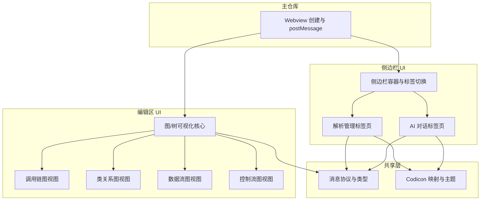

# 可视化界面：详细功能与架构设计

本文档对 UI 子仓库（或主仓库内可视化实现）做实现级拆解，每个模块或紧密相关的视图/资源以 **约 500-800 行代码** 为粒度，便于分工与估量。与 [模块功能说明.md](模块功能说明.md)、[UI与交互逻辑.md](UI与交互逻辑.md) 配套使用。

---

## 1. 概述与设计原则

### 1.1 UI 子仓库定位

- **codexray-ui**（或等价实现）：提供侧边栏双标签（**解析管理**、**AI 对话**）与编辑区图/树可视化（调用链、类关系、数据流、控制流）的 **视图实现**。
- **不直接访问**解析引擎或 Agent；所有数据与用户意图通过**主仓库**注入与回传（Webview postMessage）。

### 1.2 粒度约定

- 单组件或紧密相关的视图/资源合计约 **500-800 行**（HTML/TS/CSS/React 等），便于单人单任务实现与联调。
- **所有按钮均使用 VSCode 图标**（Codicon/ThemeIcon）；在 Webview 内通过约定方式使用 Codicon（见第 2 节技术选型）。

---

## 2. 技术选型

实现时需在本节确定具体选型，便于统一技术栈；以下为建议项与可选方案。

### 2.1 前端框架与形态

| 方案 | 描述 | 适用场景 |
|------|------|----------|
| **A：纯 HTML + TS/JS + CSS** | 单页或多页，无框架；侧边栏单 HTML 内双 panel + 标签切换，编辑区图单独 HTML | Webview 内轻量、与主仓库共处一仓、快速迭代 |
| **B：React / Vue** | 组件化开发，打包为静态资源（如 `dist/sidebar.html`、`dist/graph.html`） | 子仓库独立、复杂交互与状态、多人协作 |

**选定后需说明**：构建工具（Webpack / Vite / Rollup）、输出产物目录与入口 HTML、主仓库加载方式（`webview.asWebviewUri` + 扩展内路径或 npm 包内资源路径）。

### 2.2 图/树可视化库

- **可选**：D3.js、vis-network、Cytoscape.js、ECharts、Mermaid 等；需支持**节点+边**、**缩放/平移**、**节点点击回调**（用于 gotoSymbol）。
- **选定后需说明**：与四种视图（调用链、类关系、数据流、控制流）的适配方式——**统一图组件 + 不同 layout/数据适配**，或各视图独立封装；与 500-800 行粒度下「图核心 + 各视图适配层」的划分一致。
- **数据格式**：消费 [01-解析引擎/接口约定](../01-解析引擎/接口约定.md) 第 3 节的查询结果 JSON（节点含 usr、definition、definition_range；边含 edge_type、call_site 等），不重复定义 schema。

### 2.3 Webview 内图标（Codicon）

- Webview **无法直接**使用 VSCode 的 `ThemeIcon` API。
- **约定方式**（任选其一或组合）：
  - 使用 **Codicon 字体**：扩展将 `codicon` 的 webfont 与 CSS 随扩展打包，Webview HTML 通过 `link` 引用扩展提供的 CSS，使用 class 名（如 `codicon-play`）渲染图标。
  - **主仓库注入**：主仓库在创建 Webview 时通过 `html` 或 `postMessage` 注入图标 SVG/unicode 映射，UI 侧按名查找渲染。
- 文档中需注明：**图标资源来源**（如 `node_modules/@vscode/codicons/dist/codicon.css` 及字体路径）、在 HTML/CSS 中的**使用方式**（class 名或 data-icon 属性）。

### 2.4 样式与主题

- 与 VSCode 主题一致：使用 VSCode Webview 官方推荐的 **CSS 变量**（如 `var(--vscode-font-family)`、`var(--vscode-editor-background)` 等），主仓库在 Webview 的 `html` 中可通过 `vscode.getState()` 或注入的 script 设置 `document.documentElement.style` 或注入 `<style>`。
- 需列出 UI 侧**实际使用的变量名**或约定（字体、背景、前景、边框、按钮等），以便与深色/浅色主题一致。

### 2.5 构建与打包

- **子仓库为 npm 包时**：构建脚本（如 `npm run build`）、产物目录（如 `dist/` 下 `sidebar.html`、`graph.html`、JS/CSS）、主仓库引用方式（npm 依赖 + `context.asAbsolutePath('node_modules/codexray-ui/dist/...')` 或发布时复制到扩展目录）。
- **UI 与主仓库同仓时**：如 `resources/sidebar/`、`resources/visualization/` 的目录结构，是否有单独 `build` 步骤（如 TS 编译、打包），主仓库如何指向入口 HTML。

---

## 3. 架构总览与分层

### 3.1 分层示意



### 3.2 建议目录结构

```
sidebar/                    # 侧边栏
  index.html                # 入口，内嵌双标签与脚本
  sidebar.ts                # 标签切换、postMessage 路由（若 TS 编译）
  parse-tab/
    parse-tab.html          # 或组件
    parse-tab.ts
  chat-tab/
    chat-tab.html
    chat-tab.ts
visualization/              # 编辑区图
  graph.html                # 图入口
  graph.ts                  # 通用图组件：节点+边、缩放、点击回调
  call-graph.ts             # 调用链数据适配（可选）
  class-graph.ts
  data-flow.ts
  control-flow.ts
shared/
  protocol.ts               # action/message 类型、payload 类型
  types.ts                  # 与主仓库约定的 JSON 结构（历史、图数据等）
  icons.ts                  # Codicon 名到 class/unicode 映射、主题变量
```

若子仓库为 npm 包，可输出打包后的 `dist/sidebar.html`、`dist/graph.html` 及类型定义，供主仓库 Webview 使用。

---

## 4. 模块清单与预估行数

| 模块 | 职责概要 | 主要文件/目录 | 预估行数 | 依赖 | 与主仓库对接点 | 对应 UI 与交互逻辑 |
|------|----------|----------------|----------|------|----------------|-------------------|
| 侧边栏容器与标签切换 | 单页内「解析管理」「AI 对话」两面板、标签切换、postMessage 路由（按 action 分发） | sidebar/index.html + sidebar.ts | 500-700 | shared | 主仓库加载 HTML；postMessage 双向收发 | 布局约定、双标签 |
| 解析管理标签页 | 工程路径/compile_commands 展示与输入、解析/历史按钮、历史列表、进度展示；Codicon；postMessage runParse/listHistory/getProject | sidebar/parse-tab/ | 500-800 | shared | UI→host: runParse, listHistory, setProject, setCompileCommands；host→UI: parseProgress, parseDone, historyList, initState | 工程选择与解析触发、设置与状态 |
| AI 对话标签页 | 输入框、发送、历史消息、引用当前符号；流式追加；Codicon；postMessage sendChat/getContext，接收 replyChunk/replyDone | sidebar/chat-tab/ | 500-800 | shared | UI→host: sendChat, getContext；host→UI: replyChunk, replyDone, error | AI 对话窗口 |
| 图/树可视化核心 | 接收 type + data，渲染节点与边；节点点击 postMessage gotoSymbol(uri, line, column)；缩放/平移 | visualization/graph.ts + graph.html | 600-800 | shared, 01-解析引擎接口约定 | host 传入 type+data；UI→host: gotoSymbol | 查询与展示、可视化与代码互相交互 |
| 调用链图视图 | 调用链数据驱动图核心（节点=函数，边=调用，edge_type）；或为图核心配置层 | visualization/call-graph.ts 或配置 | 300-500 | 图核心 | 同图核心，data 为 call_graph 格式 | 调用链图 |
| 类关系图视图 | 节点=类，边=继承/组合/依赖 | visualization/class-graph.ts | 300-500 | 图核心 | 同图核心，data 为 class_graph 格式 | 类关系图 |
| 数据流图视图 | 节点=变量/读写点，边=数据流 | visualization/data-flow.ts | 300-500 | 图核心 | 同图核心，data 为 data_flow 格式 | 数据流图 |
| 控制流图视图 | 节点=基本块，边=控制流 | visualization/control-flow.ts | 300-500 | 图核心 | 同图核心，data 为 control_flow 格式 | 控制流图 |
| 共享层 | 消息协议、数据 JSON 类型、Codicon 映射、主题变量 | shared/protocol.ts, types.ts, icons.ts | 200-400 | - | 定义 UI↔host 的 action/message 与 payload | 全流程 |

---

## 5. 各模块详细设计

### 5.1 侧边栏容器与标签切换

- **功能**：提供侧边栏单页，内有两个面板「解析管理」「AI 对话」及标签按钮；用户点击标签切换显示面板；接收主仓库 postMessage 后按 action 类型分发给对应标签页逻辑；不实现具体表单或聊天逻辑。
- **公开接口**：入口 HTML（如 `sidebar.html`）；内部约定 `window.postMessage` 或 `acquireVsCodeApi().postMessage` 与主仓库通信；路由表：runParse/listHistory/setProject/setCompileCommands → 解析管理；sendChat/getContext、replyChunk/replyDone → AI 对话。
- **关键实现要点**：单 Webview 内两个 panel + 标签切换，避免多 Webview 带来的状态分散；主仓库注入的 script 或 inline 脚本中获取 `acquireVsCodeApi()` 并统一 postMessage；样式使用 2.4 节约定的 CSS 变量。
- **预估行数**：500-700。
- **引用**：[UI与交互逻辑](UI与交互逻辑.md) 第 1 节布局约定。

### 5.2 解析管理标签页

- **功能**：展示并编辑工程路径、compile_commands 路径；「解析」「历史」按钮；历史解析记录列表（run_id、时间、mode、files_parsed、status）；解析进行时显示进度（百分比可由主仓库随 parseProgress 下发）。不调用解析引擎，仅通过 postMessage 发送 runParse/listHistory 等。
- **公开接口**：发送 `{ action: 'runParse' }`、`{ action: 'listHistory' }`、`{ action: 'setProject', path }`、`{ action: 'setCompileCommands', path }`；接收 `{ type: 'parseProgress', percent }`、`{ type: 'parseDone', result }`、`{ type: 'historyList', runs }`、`{ type: 'initState', projectPath, compileCommandsPath }`。
- **关键实现要点**：所有按钮使用 Codicon（见 2.3）；历史列表用 runs 数组渲染；解析按钮点击后可选禁用直至 parseDone/error。
- **预估行数**：500-800。
- **引用**：[UI与交互逻辑](UI与交互逻辑.md) 第 2 节工程选择与解析触发。

### 5.3 AI 对话标签页

- **功能**：输入框、发送按钮、历史消息列表、可选「引用当前符号」按钮；用户发送时 postMessage(sendChat, message, context)；接收主仓库下发的 replyChunk（流式）与 replyDone，逐 chunk 追加到当前回复或一次性展示。不连接 Agent。
- **公开接口**：发送 `{ action: 'sendChat', message, context? }`、`{ action: 'getContext' }`；接收 `{ type: 'replyChunk', chunk }`、`{ type: 'replyDone', full? }`、`{ type: 'error', message }`。
- **关键实现要点**：Codicon 用于发送、引用等按钮；流式时 UI 将 replyChunk 追加到当前消息气泡，replyDone 时可选滚动到底部。
- **预估行数**：500-800。
- **引用**：[UI与交互逻辑](UI与交互逻辑.md) 第 4 节 AI 对话窗口。

### 5.4 图/树可视化核心

- **功能**：接收主仓库传入的 type（call_graph/class_graph/data_flow/control_flow）与 data（JSON）；将 data 转为图库所需节点/边结构并渲染；支持缩放、平移；节点点击时 postMessage(gotoSymbol, uri, line, column)。不查询 DB，仅消费传入的 JSON。
- **公开接口**：入口 HTML 或脚本从 `acquireVsCodeApi()` 或 URL 参数/初始消息获取 type 与 data；发送 `{ action: 'gotoSymbol', uri, line, column }`。
- **关键实现要点**：data 结构符合 [01-解析引擎/接口约定](../01-解析引擎/接口约定.md) 第 3 节（节点含 usr、definition、definition_range；边含 edge_type、call_site）；节点点击时从节点数据取 definition 或 definition_range 的 file/line/column 发送 gotoSymbol。
- **预估行数**：600-800。
- **引用**：[UI与交互逻辑](UI与交互逻辑.md) 第 3、3.1 节；[01-解析引擎/接口约定](../01-解析引擎/接口约定.md) 第 3 节。

### 5.5 调用链图 / 类关系图 / 数据流图 / 控制流图视图

- **功能**：以解析引擎返回的对应 JSON 格式驱动图核心；可视为图核心的**数据适配层**或**配置层**（将 call_graph/class_graph/data_flow/control_flow 的节点边结构统一成图库格式）。若图核心已支持泛型节点/边，可合并为配置；否则各视图约 300-500 行。
- **公开接口**：与图核心一致；输入为各自类型的 data，输出为图核心的 nodes/edges 或等价结构。
- **关键实现要点**：调用链需区分 edge_type（direct/via_function_pointer）；类关系需区分 relation_type；数据流、控制流按 01-解析引擎接口约定中的结构映射。
- **预估行数**：各 300-500。
- **引用**：[01-解析引擎/接口约定](../01-解析引擎/接口约定.md) 第 3 节。

### 5.6 共享层

- **功能**：定义 UI 与主仓库的 **postMessage 协议**（action 名、payload 类型）；定义历史列表、图数据等 JSON 类型（或引用 01-解析引擎类型）；Codicon 名到 class/unicode 的映射；主题相关 CSS 变量名或注入方式。
- **公开接口**：protocol.ts 导出 action 类型、message 类型、payload 接口；types.ts 导出 ParseRun、GraphData 等；icons.ts 导出 getIconClass(name) 或图标表。
- **关键实现要点**：与主仓库「命令与视图清单」「主仓库详细设计」中的 sidebarView/parseManageTab/chatTab/visualizationProvider 约定一致，避免 action 名或字段不一致。
- **预估行数**：200-400。
- **引用**：全文；主仓库 [主仓库详细功能与架构设计](../00-主仓库/主仓库详细功能与架构设计.md) 第 5 节数据流。

---

## 6. 关键数据流（UI 与主仓库协作）

### 6.1 解析管理

1. 主仓库加载侧边栏 Webview，注入初始状态（如 `initState: { projectPath, compileCommandsPath }`）。
2. 用户点击「解析」→ UI 发送 `{ action: 'runParse' }` → 主仓库调用 parserService.parse()。
3. 主仓库收到解析进度 → 向 Webview 发送 `{ type: 'parseProgress', percent }` → UI 在解析管理标签页更新进度展示。
4. 解析结束 → 主仓库发送 `parseDone` 或 `error` → UI 恢复按钮、可选刷新历史；用户点击「历史」→ UI 发送 `listHistory` → 主仓库返回 `historyList` → UI 渲染列表。

### 6.2 AI 对话

1. 用户输入并点击发送 → UI 发送 `{ action: 'sendChat', message, context? }`。
2. 主仓库调用 agentService.sendChat，收到流式 chunk → 向 Webview 发送 `{ type: 'replyChunk', chunk }`。
3. UI 将 chunk 追加到当前回复气泡；主仓库发送 `{ type: 'replyDone' }` 或带 full 文本 → UI 完成该条消息。

### 6.3 编辑区图与定位到代码

1. 主仓库打开可视化 Webview，传入 type 与 data（如通过 Webview 的 html 中注入或首次 postMessage）。
2. 图核心渲染；用户点击节点 → UI 从节点数据取 uri/line/column → 发送 `{ action: 'gotoSymbol', uri, line, column }`。
3. 主仓库执行 codexray.gotoSymbolInEditor（showTextDocument + revealRange），编辑器定位到对应代码。

---

## 7. 与主仓库的集成边界

- **主仓库职责**：创建并持有 Webview、加载 UI 资源（HTML/JS/CSS）、收发 postMessage、解析 action 并调用 ParserService/AgentService/GotoSymbol；将解析结果、历史、进度、Agent 回复等通过 postMessage 传给 UI；注入 Codicon 资源与主题变量（若采用 2.3、2.4 约定）。
- **UI 职责**：渲染、用户输入、按钮与 Codicon 展示、postMessage 发送用户意图、接收主仓库下发的数据并更新视图；**不持有**解析引擎或 Agent 的引用，不直接访问 DB 或网络。
- **若 UI 为独立 npm 包**：约定打包产物（dist 下 HTML/JS/CSS）、postMessage 协议与数据类型（可共享 shared 中的类型定义）；主仓库按协议对接；在「主仓库详细设计」中 sidebarView、parseManageTab、chatTab、visualizationProvider 与本文档各模块一一对应。

---

## 8. 与现有 doc 的对应关系

- 本设计是 [模块功能说明](模块功能说明.md) 的**实现级拆解**；[UI与交互逻辑](UI与交互逻辑.md) 中的每条界面位置、触发条件、数据来源与去向均在本文档落到具体组件与 postMessage 协议。
- 查询结果的数据结构以 [01-解析引擎/接口约定](../01-解析引擎/接口约定.md) 为准；UI 不重复定义 schema，仅引用并说明图组件消费的字段（如 definition、definition_range、edge_type）。
- 主仓库侧集成方式见 [00-主仓库/主仓库详细功能与架构设计](../00-主仓库/主仓库详细功能与架构设计.md) 第 4 节（侧边栏容器、解析管理标签页、AI 对话标签页、可视化编辑区标签）。
