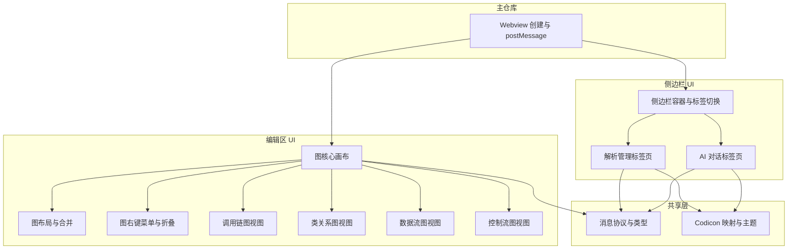

# 可视化界面：详细功能与架构设计

本文档对 UI 子仓库（或主仓库内可视化实现）做实现级拆解，每个模块或紧密相关的视图/资源以 **约 500-800 行代码** 为粒度，便于分工与估量。与 [模块功能说明.md](模块功能说明.md)、[UI与交互逻辑.md](UI与交互逻辑.md) 配套使用。

---

## 1. 概述与设计原则

### 1.1 UI 子仓库定位

- **codexray-ui**（或等价实现）：提供侧边栏双标签（**解析管理**、**AI 对话**）与编辑区图/树可视化（调用链、类关系、数据流、控制流）的 **视图实现**。
- **不直接访问**解析引擎或 Agent；所有数据与用户意图通过**主仓库**注入与回传（Webview postMessage）。

### 1.2 粒度约定

- 单组件或紧密相关的视图/资源合计约 **500-800 行**（HTML/TS/CSS/React 等），便于单人单任务实现与联调。
- **所有按钮均使用 VSCode 图标**（Codicon/ThemeIcon）；在 Webview 内通过约定方式使用 Codicon（见第 2 节技术选型）。

---

## 2. 技术选型（明确选定，均采用成熟库）

本节为**最终选定**的技术栈，实现时必须按此执行；所选均为业界成熟、维护活跃的库。

### 2.1 前端框架与形态（选定）

- **选定**：**React 18+** + **TypeScript**，单页多入口（侧边栏单页、编辑区图单页）。
- **理由**：React 生态成熟、VSCode 扩展与 Webview 社区广泛使用；组件化便于侧边栏双标签与图视图拆分到 500-800 行粒度；TypeScript 与主仓库一致，利于类型共享。
- **构建工具**：**Vite 5.x**。理由：官方推荐、构建快、产物清晰、与 React/TS 开箱即用。
- **输出产物**：`dist/sidebar.html`（侧边栏入口）、`dist/graph.html`（编辑区图入口），以及对应 chunk 的 JS/CSS；资源带 hash 时由 Vite 自动注入到 HTML。
- **主仓库加载**：主仓库使用 `webview.asWebviewUri(vscode.Uri.joinPath(extensionUri, 'dist', 'sidebar.html'))`（或 npm 包内等价路径）加载；脚本与样式通过同一扩展 URI 下的路径用 `asWebviewUri` 转换后注入，满足 Webview 本地资源策略。

### 2.2 图/树可视化库（选定）

- **选定**：**AntV G6 v5**（npm: `@antv/g6@^5`），为 AntGroup 开源的高性能图可视化引擎。
- **理由**：原生支持 Canvas/WebGL 渲染、海量节点高性能；内置 dagre/force/tree 等布局引擎；完善的插件系统（History 撤销恢复、Tooltip、ContextMenu）；支持节点端口（Ports）系统，边自动选择最近端口连接；状态管理系统（highlight/dimmed/selected）开箱即用。
- **适配方式**：
  - **图核心**（`G6Graph.tsx`）通过 React `useRef` + `useImperativeHandle` 管理 G6 Graph 实例生命周期，暴露 `setData`/`appendData`/`fitView`/`relayout`/`removeNode`/`removeNodes` 给父组件。
  - **配置工厂**（`g6Config.ts`）统一管理节点/边/行为/插件配置。
  - **数据适配**（`g6Adapter.ts`）将 adapter 输出转为 G6 格式，并提供增量合并与边去重。
  - **自定义布局**（`g6Layout.ts`）注册 `bidirectional-dagre` 布局：BFS 计算有向层级（caller 负层级 / callee 正层级 / root 为 0），注入 dagre rank 约束实现根居中分层。
  - 各视图适配层（`adapters/`）将 API JSON 转为中性 `AdapterNode`/`AdapterEdge` 类型（`adapters/types.ts`），不依赖任何图库。
- **布局**：采用**双向树状布局**（`g6Layout.ts`）：BFS 从根节点出发，正向遍历 callees 分配正层级，反向遍历 callers 分配负层级，再注入 dagre rank 约束。根节点居中，调用者在左、被调用者在右（LR 方向）。层间距 RANK_SEP=120、同层节点间距 NODE_SEP=40。
- **节点**：rect 类型，宽 280，高度根据 label 行数动态计算（最小 60），圆角 8px。根节点橙色（`rgb(193,125,55)`），普通节点蓝色（`rgb(81,154,186)`）。4 个连接端口（上右下左），边自动选择最近端口。
- **边**：`cubic-horizontal` 水平曲线 + 箭头。同 (source,target) 仅保留一条、总数上限 2500 条。
- **图交互能力**：
  - **节点**：支持**选中**（单击选中 `click-select`）、**Shift 框选**（`brush-select`）、**拖拽移动**（`drag-element`）、**删除**（右键菜单 / 批量删除）。
  - **画布**：支持**拖拽平移**（`drag-canvas`）、**滚轮缩放**（`zoom-canvas`，范围 5%~200%）。
  - **路径高亮**：单击节点时 BFS 找从根节点到目标的最短路径，路径上节点/边设 `highlight` 状态，其余设 `dimmed`；点击画布清除。
  - **撤销/恢复**：G6 History 插件，Ctrl+Z 撤销、Ctrl+Shift+Z / Ctrl+Y 恢复。
  - **图查询与扩展**：**默认查询深度为 2 层**；**右键节点**提供「展开前置节点」「展开后置节点」，UI 发送 `queryPredecessors`/`querySuccessors`，主仓库返回增量数据合并到当前图。
  - **工具栏**：右下角浮动按钮——「适应画布」（fitView）、「重新布局」（relayout）。
- **数据格式**：图核心只消费 API JSON（节点含 usr、definition、definition_range；边含 edge_type、call_site 等），不解析 DB。

### 2.3 Webview 内图标（Codicon）（选定）

- **选定**：使用 **@vscode/codicons** 官方 webfont + CSS，随扩展打包进 Webview。
- **资源来源**：npm 包 `@vscode/codicons`，其 `dist/codicon.css` 与 `dist/codicon.ttf`（或 woff2）由主仓库或 UI 构建脚本复制到扩展 `resources/codicons/`（或 dist 内），Webview HTML 通过主仓库注入的 `link` 引用该 CSS（URI 经 `asWebviewUri` 转换）。
- **使用方式**：在 HTML 中使用 `<span class="codicon codicon-{name}"></span>`，其中 `name` 为 Codicon 名（如 `play`、`send`、`folder-opened`）。名称列表见 [VSCode Codicon 官方列表](https://code.visualstudio.com/api/references/icons-in-labels)。
- **约定**：所有按钮图标统一使用上述 class 名，不使用自定义图片或第三方图标库。

### 2.4 样式与主题（选定）

- **选定**：使用 VSCode Webview 官方 **CSS 变量**，主仓库在创建 Webview 时注入包含以下变量的 `<style>` 或通过 `document.documentElement.style` 设置，使 UI 与编辑器主题一致。
- **必须使用的变量名**（见 [VSCode Webview 文档](https://code.visualstudio.com/api/extension-guides/webview#theming-webview-content)）：
  - `--vscode-font-family`、`--vscode-font-size`、`--vscode-font-weight`
  - `--vscode-editor-background`、`--vscode-editor-foreground`
  - `--vscode-button-background`、`--vscode-button-foreground`、`--vscode-button-hoverBackground`
  - `--vscode-input-background`、`--vscode-input-foreground`、`--vscode-input-border`
  - `--vscode-list-hoverBackground`、`--vscode-list-activeSelectionBackground`、`--vscode-list-activeSelectionForeground`
  - `--vscode-sideBar-background`、`--vscode-sideBar-foreground`（侧边栏页）
- UI 侧所有背景/前景/边框/按钮/列表样式均引用上述变量，不写死颜色。

### 2.5 构建与打包（选定）

- **子仓库为 npm 包时**：使用 **Vite** 构建，脚本 `npm run build`；产物为 `dist/` 下 `sidebar.html`、`graph.html` 及 Vite 生成的 JS/CSS；主仓库通过 `context.asAbsolutePath` 指向 `node_modules/codexray-ui/dist/` 或发布时复制到扩展目录，再用 `asWebviewUri` 加载。
- **UI 与主仓库同仓时**：源码放在 `resources/ui/`（或 `packages/ui/`），同样用 Vite 构建到 `resources/ui/dist/`；主仓库加载时使用 `Uri.joinPath(context.extensionUri, 'resources', 'ui', 'dist', 'sidebar.html')` 等，经 `asWebviewUri` 后设为 Webview 的 `src` 或 HTML 中的脚本/样式 base。
- **Codicon 资源**：构建时可将 `node_modules/@vscode/codicons/dist/` 复制到 `dist/codicons/`，或由主仓库从扩展安装目录读取并注入；Webview 内仅通过 link 引用，不依赖 node_modules 路径。

### 2.6 AI 对话消息渲染（选定）

- **选定**：AI 对话中的**消息内容（含用户发送与 Agent 回复）均使用 Markdown 格式渲染**，支持标题、列表、代码块、加粗、链接等。
- **实现库**：**react-markdown**（npm: `react-markdown`），React 生态内成熟的 Markdown 渲染库；可选配合 `remark-gfm` 支持 GFM（表格、删除线、自动链接等）。
- **约定**：消息气泡内将原始文本作为 Markdown 传入 `<ReactMarkdown>` 渲染；代码块需使用与编辑器一致的等宽字体与主题变量（如 `--vscode-editor-font-family`、`--vscode-textBlockQuote-background`）；流式追加时对当前回复的 Markdown 可增量重渲染或缓冲到 replyDone 后一次性渲染，由实现选择。

---

## 3. 架构总览与分层

### 3.1 分层示意



### 3.2 建议目录结构

```
sidebar/                    # 侧边栏
  index.html                # 入口，内嵌双标签与脚本
  sidebar.ts                # 标签切换、postMessage 路由（若 TS 编译）
  parse-tab/
    parse-tab.html          # 或组件
    parse-tab.ts
  chat-tab/
    chat-tab.html
    chat-tab.ts
visualization/              # 编辑区图
  graph.html                # 图入口
  GraphCore.tsx             # 图核心画布（ReactFlow、状态、事件）
  graphLayout.ts            # 双向树状布局 + 同层对齐
  graphMerge.ts             # graphAppend 去重合并
  GraphContextMenu.tsx       # 右键「查询前置/后置」
  useGraphCollapse.ts        # 折叠/展开状态与过滤
  call-graph.ts             # 调用链数据适配（可选）
  class-graph.ts
  data-flow.ts
  control-flow.ts
shared/
  protocol.ts               # action/message 类型、payload 类型
  types.ts                  # 与主仓库约定的 JSON 结构（历史、图数据等）
  icons.ts                  # Codicon 名到 class/unicode 映射、主题变量
```

若子仓库为 npm 包，可输出打包后的 `dist/sidebar.html`、`dist/graph.html` 及类型定义，供主仓库 Webview 使用。

---

## 4. 模块清单与预估行数

| 模块 | 职责概要 | 主要文件/目录 | 预估行数 | 依赖 | 与主仓库对接点 | 对应 UI 与交互逻辑 |
|------|----------|----------------|----------|------|----------------|-------------------|
| 侧边栏容器与标签切换 | 单页内「解析管理」「AI 对话」两面板、标签切换、postMessage 路由（按 action 分发） | sidebar/SidebarContainer.tsx | 500-700 | shared | 主仓库加载 HTML；postMessage 双向收发 | 布局约定、双标签 |
| 解析管理标签页 | 工程路径/compile_commands 展示与输入、解析/历史按钮、历史列表、进度展示；Codicon；postMessage | sidebar/parse-tab/ | 500-800 | shared | UI→host: runParse, listHistory, setProject, setCompileCommands；host→UI: parseProgress, parseDone, historyList, initState | 工程选择与解析触发、设置与状态 |
| AI 对话标签页 | 输入框、发送、历史消息（Markdown 渲染）、引用当前符号；流式追加；Codicon；postMessage | sidebar/chat-tab/ | 500-800 | shared | UI→host: sendChat, getContext；host→UI: replyChunk, replyDone, error | AI 对话窗口 |
| **图核心画布** | ReactFlow 容器、nodes/edges 状态、选中/框选/拖拽/删除/缩放平移、点击 gotoSymbol、接收 data 与 graphAppend 并调用 merge 与 layout | visualization/GraphCore.tsx | 500-700 | shared, graphLayout, graphMerge | host 传入 type+data；UI→host: gotoSymbol；host→UI: graphAppend | 查询与展示、可视化与代码互相交互 |
| **图布局与合并** | 双向树状布局（根居中、前驱左/后继右、同层对齐）；graphAppend 按 id 去重合并 | visualization/graphLayout.ts, graphMerge.ts | 200-400 | shared | 无（图核心内部使用） | - |
| **图右键菜单与折叠** | 右键「查询前置/后置」菜单与 postMessage；节点折叠/展开状态与显隐过滤 | visualization/GraphContextMenu.tsx, useGraphCollapse.ts | 250-450 | shared, 图核心 | UI→host: queryPredecessors, querySuccessors | 查询与展示、下钻扩展 |
| 调用链图视图 | 调用链数据→nodes/edges，edge_type；或为图核心配置层 | visualization/call-graph.ts 或配置 | 300-500 | 图核心 | 同图核心，data 为 call_graph 格式 | 调用链图 |
| 类关系图视图 | 节点=类，边=继承/组合/依赖 | visualization/class-graph.ts | 300-500 | 图核心 | 同图核心，data 为 class_graph 格式 | 类关系图 |
| 数据流图视图 | 节点=变量/读写点，边=数据流 | visualization/data-flow.ts | 300-500 | 图核心 | 同图核心，data 为 data_flow 格式 | 数据流图 |
| 控制流图视图 | 节点=基本块，边=控制流 | visualization/control-flow.ts | 300-500 | 图核心 | 同图核心，data 为 control_flow 格式 | 控制流图 |
| 共享层 | 消息协议、数据 JSON 类型、Codicon 映射、主题变量 | shared/protocol.ts, types.ts, icons.ts | 200-400 | - | 定义 UI↔host 的 action/message 与 payload | 全流程 |

**说明**：图/树相关原「图核心」单模块职责过多（画布+布局+合并+右键+折叠），易超 800 行，已拆为 **图核心画布**、**图布局与合并**、**图右键菜单与折叠** 三个子模块，各控制在 500-800 或 200-450 行内。

### 4.1 模块粒度检查与拆分建议

- **侧边栏容器、解析管理标签页、AI 对话标签页**：职责边界清晰，单目录内 500-800 行可完成；若解析管理页后续增加「工程选择弹窗」或历史详情，可拆出 `ParseTabForm.tsx` / `ParseTabHistoryList.tsx`；若 AI 对话消息列表与输入区膨胀，可拆出 `ChatInput.tsx`、`MessageList.tsx`，各控制在 300-400 行。
- **图/树可视化**：原「图核心」同时承担画布、布局、合并、右键菜单、折叠展开，实现易达 1000+ 行，**已按上表拆分为三块**：① 图核心画布（ReactFlow + 状态 + 事件，调用 layout/merge）；② 图布局与合并（纯逻辑，双向树状布局 + 同层对齐 + 去重合并）；③ 图右键菜单与折叠（UI + 状态 hook）。拆分后单文件/单职责均在 500-800 或 200-450 行内。
- **四种图视图**：各为数据适配层，300-500 行合理；若与图核心共用「数据→nodes/edges」管道且仅配置差异，可合并为一份适配器+配置表，总行数仍可控。
- **共享层**：protocol + types + icons，200-400 行；若类型与 01-解析引擎对齐且引用其类型定义，可进一步压缩。

---

## 5. 各模块详细设计

### 5.1 侧边栏容器与标签切换

- **功能**：提供侧边栏单页，内有两个面板「解析管理」「AI 对话」及标签按钮；用户点击标签切换显示面板；接收主仓库 postMessage 后按 action 类型分发给对应标签页逻辑；不实现具体表单或聊天逻辑。
- **公开接口**：入口 HTML（如 `sidebar.html`）；内部约定 `window.postMessage` 或 `acquireVsCodeApi().postMessage` 与主仓库通信；路由表：runParse/listHistory/setProject/setCompileCommands → 解析管理；sendChat/getContext、replyChunk/replyDone → AI 对话。
- **关键实现要点**：单 Webview 内两个 panel + 标签切换，避免多 Webview 带来的状态分散；主仓库注入的 script 或 inline 脚本中获取 `acquireVsCodeApi()` 并统一 postMessage；样式使用 2.4 节约定的 CSS 变量。
- **预估行数**：500-700。
- **引用**：[UI与交互逻辑](UI与交互逻辑.md) 第 1 节布局约定。

### 5.2 解析管理标签页

- **功能**：展示并编辑工程路径、compile_commands 路径；「解析」「历史」按钮；历史解析记录列表（run_id、时间、mode、files_parsed、status）；解析进行时显示进度（百分比可由主仓库随 parseProgress 下发）。不调用解析引擎，仅通过 postMessage 发送 runParse/listHistory 等。
- **公开接口**：发送 `{ action: 'runParse' }`、`{ action: 'listHistory' }`、`{ action: 'setProject', path }`、`{ action: 'setCompileCommands', path }`；接收 `{ type: 'parseProgress', percent }`、`{ type: 'parseDone', result }`、`{ type: 'historyList', runs }`、`{ type: 'initState', projectPath, compileCommandsPath }`。
- **关键实现要点**：所有按钮使用 Codicon（见 2.3）；历史列表用 runs 数组渲染；解析按钮点击后可选禁用直至 parseDone/error。
- **预估行数**：500-800。
- **引用**：[UI与交互逻辑](UI与交互逻辑.md) 第 2 节工程选择与解析触发。

### 5.3 AI 对话标签页

- **功能**：输入框、发送按钮、历史消息列表、可选「引用当前符号」按钮；**消息内容（用户与 Agent）均以 Markdown 格式渲染**（见 2.6 节）。用户发送时 postMessage(sendChat, message, context)；接收主仓库下发的 replyChunk（流式）与 replyDone，逐 chunk 追加到当前回复或一次性展示。不连接 Agent。
- **公开接口**：发送 `{ action: 'sendChat', message, context? }`、`{ action: 'getContext' }`；接收 `{ type: 'replyChunk', chunk }`、`{ type: 'replyDone', full? }`、`{ type: 'error', message }`。
- **关键实现要点**：Codicon 用于发送、引用等按钮；使用 **react-markdown**（可选 remark-gfm）将消息正文按 Markdown 渲染，代码块等使用 VSCode 主题变量；流式时 UI 将 replyChunk 追加到当前消息气泡，replyDone 时可选滚动到底部。
- **预估行数**：500-800。
- **引用**：[UI与交互逻辑](UI与交互逻辑.md) 第 4 节 AI 对话窗口。

### 5.4 图核心画布（GraphCore）

- **功能**：React Flow 画布容器；维护 nodes/edges 状态；接收主仓库传入的 type 与 data（或由上层适配器转换后的 nodes/edges），**默认展示深度由配置 codexray.queryDepth（默认 2）决定**。**必须支持**：节点选中/框选/拖拽移动/删除、画布放大/缩小/平移（React Flow 配置）；节点单击时从 node.data 取 definition/definition_range，postMessage(gotoSymbol)。收到 `graphAppend` 时调用 **graphMerge** 去重合并，再调用 **graphLayout** 重算位置后更新 state。不包含右键菜单与折叠逻辑，由 5.5、5.6 提供。
- **公开接口**：`<GraphCore type={} initialData={} onGotoSymbol={} />`；内部从 `acquireVsCodeApi()` 或 props 获取 type/data；发送 gotoSymbol；接收 graphAppend 并调用 merge + layout 后 setNodes/setEdges。
- **关键实现要点**：使用 `graphLayout.ts` 的 `getLayoutedElements(nodes, edges)`、`graphMerge.ts` 的 `mergeGraph(currentNodes, currentEdges, appendNodes, appendEdges)`；React Flow 的 `nodesSelectable`、`nodesDraggable`、`onNodesDelete`、`onNodeClick` 等；不实现右键与折叠，仅消费 5.5/5.6 提供的回调或子组件。
- **预估行数**：500-700。
- **引用**：[UI与交互逻辑](UI与交互逻辑.md) 第 3、3.1 节；[01-解析引擎/接口约定](../01-解析引擎/接口约定.md) 第 3 节。

### 5.5 图布局与合并（graphLayout / graphMerge）

- **功能**：**graphLayout.ts**：输入 nodes + edges，用 @dagrejs/dagre 计算位置，返回带 `position` 的 nodes（可封装为 `getLayoutedElements(nodes, edges)`）。**graphMerge.ts**：输入当前 nodes/edges 与 graphAppend 的 nodes/edges，按节点 id 去重，只追加新节点与新边，返回合并后的 nodes/edges。
- **公开接口**：`getLayoutedElements(nodes, edges): nodes`；`mergeGraph(currentNodes, currentEdges, appendNodes, appendEdges): { nodes, edges }`。
- **关键实现要点**：布局与合并为纯函数或纯逻辑，无 UI；**双向树状布局**以无入边（或入边最少）节点为根，BFS 赋层（前驱层负、后继层正），同层节点同一 x、y 等距并整体居中；merge 时边也需去重（如按 source+target+edgeType）。
- **预估行数**：200-400（两文件合计）。
- **引用**：[01-解析引擎/接口约定](../01-解析引擎/接口约定.md) 第 3 节。

### 5.6 图右键菜单与折叠（GraphContextMenu / useGraphCollapse）

- **功能**：**GraphContextMenu**：在节点右键时展示「继续查询前置节点」「继续查询后置节点」；点击后 postMessage(queryPredecessors / querySuccessors)，携带 graphType、nodeId、symbol。**useGraphCollapse**：维护「已展开节点 id」集合，提供 toggle(nodeId)；根据该集合过滤 nodes/edges 或标记 node.data.expanded，供 GraphCore 渲染时隐藏/显示子节点或邻接边。
- **公开接口**：`<GraphContextMenu node={} graphType={} onQueryPredecessors={} onQuerySuccessors={} />`（或通过 onNodeContextMenu 挂载）；`const { expandedSet, toggle, filteredNodes, filteredEdges } = useGraphCollapse(nodes, edges)`。
- **关键实现要点**：右键菜单可用 React 组件 + 绝对定位或 VSCode 风格菜单；queryPredecessors/querySuccessors 的 payload 与 5.6 共享层 protocol 一致；折叠策略可为「隐藏该节点的所有后继/前驱边及对应节点」或「仅隐藏下一层」，由实现选择。
- **预估行数**：250-450（两文件合计）。
- **引用**：[UI与交互逻辑](UI与交互逻辑.md) 第 3 节；图相关 postMessage 见 5.8 共享层。

### 5.7 调用链图 / 类关系图 / 数据流图 / 控制流图视图

- **功能**：以解析引擎返回的对应 JSON 格式驱动图核心；可视为图核心的**数据适配层**或**配置层**（将 call_graph/class_graph/data_flow/control_flow 的节点边结构统一成图库格式）。若图核心已支持泛型节点/边，可合并为配置；否则各视图约 300-500 行。
- **公开接口**：与图核心一致；输入为各自类型的 data，输出为图核心的 nodes/edges 或等价结构。
- **关键实现要点**：调用链需区分 edge_type（direct/via_function_pointer）；类关系需区分 relation_type；数据流、控制流按 01-解析引擎接口约定中的结构映射。
- **预估行数**：各 300-500。
- **引用**：[01-解析引擎/接口约定](../01-解析引擎/接口约定.md) 第 3 节。

### 5.8 共享层

- **功能**：定义 UI 与主仓库的 **postMessage 协议**（action 名、payload 类型）；定义历史列表、图数据等 JSON 类型（或引用 01-解析引擎类型）；Codicon 名到 class/unicode 的映射；主题相关 CSS 变量名或注入方式。
- **公开接口**：protocol.ts 导出 action 类型、message 类型、payload 接口；types.ts 导出 ParseRun、GraphData 等；icons.ts 导出 getIconClass(name) 或图标表。
- **关键实现要点**：与主仓库「命令与视图清单」「主仓库详细设计」中的 sidebarView/parseManageTab/chatTab/visualizationProvider 约定一致，避免 action 名或字段不一致。图相关协议需包含：gotoSymbol、queryPredecessors、querySuccessors（UI→host）；graphAppend（host→UI，增量 nodes/edges）。
- **预估行数**：200-400。
- **引用**：全文；主仓库 [主仓库详细功能与架构设计](../00-主仓库/主仓库详细功能与架构设计.md) 第 5 节数据流。

---

## 6. 关键数据流（UI 与主仓库协作）

### 6.1 解析管理

1. 主仓库加载侧边栏 Webview，注入初始状态（如 `initState: { projectPath, compileCommandsPath }`）。
2. 用户点击「解析」→ UI 发送 `{ action: 'runParse' }` → 主仓库调用 parserService.parse()。
3. 主仓库收到解析进度 → 向 Webview 发送 `{ type: 'parseProgress', percent }` → UI 在解析管理标签页更新进度展示。
4. 解析结束 → 主仓库发送 `parseDone` 或 `error` → UI 恢复按钮、可选刷新历史；用户点击「历史」→ UI 发送 `listHistory` → 主仓库返回 `historyList` → UI 渲染列表。

### 6.2 AI 对话

1. 用户输入并点击发送 → UI 发送 `{ action: 'sendChat', message, context? }`。
2. 主仓库调用 agentService.sendChat，收到流式 chunk → 向 Webview 发送 `{ type: 'replyChunk', chunk }`。
3. UI 将 chunk 追加到当前回复气泡；主仓库发送 `{ type: 'replyDone' }` 或带 full 文本 → UI 完成该条消息。

### 6.3 编辑区图与定位到代码

1. 主仓库打开可视化 Webview，传入 type 与 data（**默认查询深度由 codexray.queryDepth 配置，默认 2 层**；主仓库调用 ParserService.query 时未传 depth 则使用 Config.getQueryDepth()）。
2. 图核心渲染；用户点击节点 → UI 从节点数据取 uri/line/column → 发送 `{ action: 'gotoSymbol', uri, line, column }`；主仓库执行 showTextDocument + revealRange。
3. 用户**右键节点**选择「继续查询前置节点」或「继续查询后置节点」→ UI 发送 `{ action: 'queryPredecessors', graphType, nodeId, symbol? }` 或 `querySuccessors`。
4. 主仓库根据 nodeId/symbol 与 graphType 从 DB 查询增量节点与边，向 Webview 发送 `{ type: 'graphAppend', nodes, edges }`；UI 将新节点/边与当前图合并（按 id 去重），在当前界面更新渲染并可选重布局，不新开标签。

---

## 7. 与主仓库的集成边界

- **主仓库职责**：创建并持有 Webview、加载 UI 资源（HTML/JS/CSS）、收发 postMessage、解析 action 并调用 ParserService/AgentService/GotoSymbol；**首次打开图时按配置深度（codexray.queryDepth，默认 2）查询并传入 data**；收到 `queryPredecessors`/`querySuccessors` 时从 DB 查询增量图数据并以 `graphAppend` 回传；将解析结果、历史、进度、Agent 回复等通过 postMessage 传给 UI；注入 Codicon 资源与主题变量（若采用 2.3、2.4 约定）。
- **UI 职责**：渲染、用户输入、按钮与 Codicon 展示、postMessage 发送用户意图、接收主仓库下发的数据并更新视图；**不持有**解析引擎或 Agent 的引用，不直接访问 DB 或网络。
- **若 UI 为独立 npm 包**：约定打包产物（dist 下 HTML/JS/CSS）、postMessage 协议与数据类型（可共享 shared 中的类型定义）；主仓库按协议对接；在「主仓库详细设计」中 sidebarView、parseManageTab、chatTab、visualizationProvider 与本文档各模块一一对应。

---

## 8. 与现有 doc 的对应关系

- 本设计是 [模块功能说明](模块功能说明.md) 的**实现级拆解**；[UI与交互逻辑](UI与交互逻辑.md) 中的每条界面位置、触发条件、数据来源与去向均在本文档落到具体组件与 postMessage 协议。
- 查询结果的数据结构以 [01-解析引擎/接口约定](../01-解析引擎/接口约定.md) 为准；UI 不重复定义 schema，仅引用并说明图组件消费的字段（如 definition、definition_range、edge_type）。
- 主仓库侧集成方式见 [00-主仓库/主仓库详细功能与架构设计](../00-主仓库/主仓库详细功能与架构设计.md) 第 4 节（侧边栏容器、解析管理标签页、AI 对话标签页、可视化编辑区标签）。
