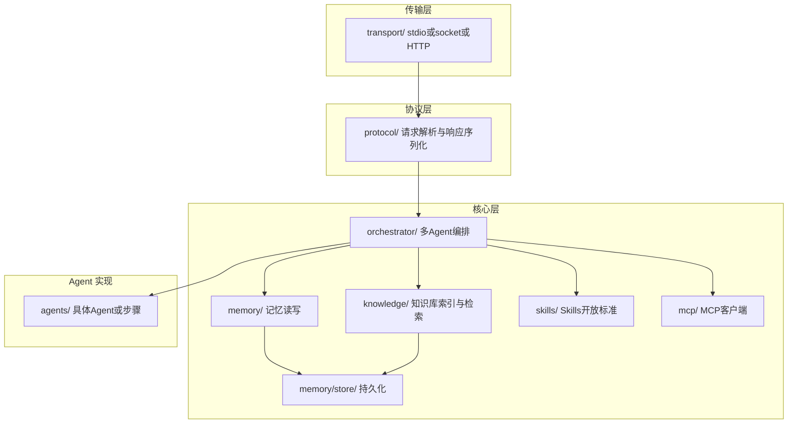

# Agent 模块：详细功能与架构设计

本文档对 AI Agent 管理模块（Rust 实现）做实现级拆解，每个模块或紧密相关的 .rs 文件以 **约 500-800 行代码** 为粒度，便于分工与估量。与 [模块功能说明.md](模块功能说明.md)、[接口与协议.md](接口与协议.md) 配套使用。

---

## 1. 概述与设计原则

### 1.1 Agent 模块职责回顾

- **子仓库**：AI Agent 管理模块（如 `codexray-agent`），**Rust** 实现。
- **职责**：**记忆管理**（短期/长期、读写 API、持久化与增量更新）；**多 Agent 编排**（流水线/路由/协作等策略，对外统一对话入口；**必须支持自定义 Agent**，用户可注册自定义 Agent 供工作流调度）；**本地知识库**（索引、RAG 检索、与 CodeXray 解析结果或主仓库推送的摘要对接）；**Skills 开放标准**；**MCP 服务**；**必须支持设置大模型**。对外以**本地服务**（stdio / Unix socket / HTTP）提供，主仓库与侧边栏 AI 对话通过主仓库后端连接本服务。

以上与 [模块功能说明](模块功能说明.md) 第 2 节功能列表及第 3～5 节约定一致。

### 1.2 粒度约定

- 单模块或紧密相关的 **.rs 合计约 500-800 行**，便于单人单任务实现与单元/集成测试。
- 若某模块（如编排器或知识库检索）因状态机或算法略超 800 行，可接受至约 900 行并在模块清单中注明；或拆为子模块。

### 1.3 技术栈

- **语言**：Rust（2018 edition 或更高）。
- **服务形态**：stdio 子进程、Unix socket 或 HTTP（localhost），以 [接口与协议](接口与协议.md) 约定为准。
- **存储**：记忆与知识库可选用 SQLite、嵌入式 KV、或嵌入式向量库（如 rusqlite + 扩展、sled、tantivy 等）；具体在「记忆存储」「知识库」模块中选定并写明。

---

## 2. 架构总览与分层

### 2.1 分层与依赖（示意）



### 2.2 建议目录结构

```
src/
  lib.rs                    # 库入口，导出主要类型与 run_server
  main.rs                   # 二进制入口，解析配置（传输方式、数据路径），启动 server
  config.rs                 # 配置：传输类型、socket 路径、HTTP 端口、存储路径等
  error.rs                  # 错误类型与 protocol 错误码映射
  protocol/                 # 协议层
    mod.rs
    request.rs              # action、session_id、message、context、memory/kb payload
    response.rs             # reply、chunk、memory_id、chunks、results、error
    codec.rs                # 逐行 JSON 或 SSE 编解码（与 transport 对接）
  transport/                # 传输层
    mod.rs
    stdio.rs                # stdio 读写循环，按行或 SSE 与 protocol 对接
    socket.rs               # Unix socket 监听与连接（可选）
    http.rs                 # HTTP/SSE 服务（可选）
  memory/                   # 记忆
    mod.rs
    short_term.rs           # 当前会话对话轮次、上下文（内存或短期存储）
    long_term.rs            # 跨会话要点、偏好；读写 API，委托 store 持久化
  memory/store/             # 记忆持久化
    mod.rs
    schema.rs               # 表结构或 KV 命名空间（与接口约定 memory_id/chunk_id 一致）
    persist.rs              # 写入、增量更新、版本/快照策略
  orchestrator/             # 多 Agent 编排（必须支持顺序/并行/监察优化工作流及组合、自定义工作流）
    mod.rs
    pipeline.rs             # 顺序工作流：步骤依次执行
    parallel.rs             # 并行工作流：多步骤并发执行并汇总
    supervision.rs          # 监察优化工作流：监察者评审/打分/修正或重试
    compose.rs              # 工作流组合：嵌套顺序/并行/监察
    custom.rs               # 自定义工作流：解析用户定义（DSL/JSON 图）并执行
    state.rs                # 会话状态、当前步骤、与 memory/knowledge 的交互
  knowledge/                # 本地知识库（树状摘要 + 树状检索 + 多格式解析与 OCR）
    mod.rs
    node.rs                 # 节点结构定义（id, tree_id, parent_id, level, summary, source, span, meta）
    tree.rs                 # 树 CRUD、建树（调用本地模型分层摘要）、层级/路径查询
    doc_parser/             # 文档解析（开源库 + OCR）
      mod.rs
      pdf.rs                # PDF 正文提取 + 扫描页 OCR（如 Tesseract）
      word.rs               # Word .docx/.doc 段落与标题提取
      markdown.rs            # Markdown 按标题/段落划分
    index.rs                # 节点表与向量/全文索引，接收 kb_update 或解析结果写入
    search.rs               # RAG 检索（语义/关键词）+ 树状检索（path、子树上下文）；kb_search / kb_tree_get
  agents/                   # Agent 实现（内置 + 自定义 Agent 支持）
    mod.rs
    retriever.rs            # 内置：检索知识库步骤
    generator.rs            # 内置：生成回复步骤（调用 LLM 或本地模型接口）
    registry.rs             # Agent 注册表：内置列表 + 自定义 Agent 注册与按 id 查找
    custom.rs               # 自定义 Agent：从配置目录加载定义、解析 definition、按类型执行（subprocess/script/llm_prompt 等）
  skills/                   # Skills 开放标准
    mod.rs
    loader.rs               # 从配置目录加载技能定义（SKILL.md 或约定格式）
    registry.rs             # 技能注册表、列出、按 id 查找
    executor.rs             # 技能调用执行（由编排器或 protocol 触发）
  mcp/                      # MCP 客户端
    mod.rs
    client.rs               # 连接 MCP 服务器、会话管理
    tools.rs                # 发现 tools、调用 call_tool
    resources.rs            # 发现 resources、read_resource（可选）
```

---

## 3. 模块清单与预估行数

| 模块 | 职责概要 | 主要文件/目录 | 预估行数 | 依赖 | 对应接口与协议 | 对应模块功能说明 |
|------|----------|----------------|----------|------|----------------|------------------|
| 入口与配置 | main 解析参数、加载配置（传输方式、存储路径）、启动 server | main.rs, config.rs | 200-400 | transport, config | §1 服务形态 | - |
| 协议层 | 请求/响应类型、action 解析、session_id/memory_id 约定、编解码（JSON/NDJSON 或 SSE） | protocol/ | 400-600 | - | §2 会话与记忆 ID、§3 请求/响应 | - |
| 传输层 | stdio 读写循环；可选 Unix socket、HTTP 服务；与 protocol codec 对接 | transport/ | 450-700 | protocol | §1、§4 流式 | - |
| 短期记忆 | 当前会话对话轮次、上下文（file/symbol/selection）；读写 API | memory/short_term.rs | 250-450 | protocol | §3.1 对话 context | 3.1 记忆管理 |
| 长期记忆与 API | 跨会话记忆读写、召回（按 session/query/tags）、委托 store 持久化 | memory/long_term.rs, memory/mod.rs | 400-600 | memory/store, protocol | §3.2 memory_write/recall | 3.1、持久化更新 |
| 记忆持久化 | 表结构/KV、写入、增量更新、版本或快照 | memory/store/ | 450-650 | config, error | §2 memory_id/chunk_id | 3.1 持久化更新 |
| 编排器 | 顺序/并行/监察优化工作流及组合、自定义工作流、统一 chat 入口、调 memory/knowledge/agents | orchestrator/ | 600-900 | memory, knowledge, agents, protocol | §3.1 chat、§3.7 工作流、§4 流式 | 3.1、§4 编排模型 |
| 知识库节点与树 | 节点结构、树 CRUD、本地模型分层摘要建树、层级/路径查询 | knowledge/node.rs, tree.rs | 500-750 | config, agents | §3.3、知识库树状结构与节点设计 | 3.1、§5 树状摘要与检索 |
| 文档解析与 OCR | PDF/Word/Markdown 解析；扫描件 OCR（开源库如 Tesseract） | knowledge/doc_parser/ | 450-700 | - | 知识库树状结构与节点设计 §4 | 3.1、§5 多格式与 OCR |
| 知识库索引 | 节点表与向量/全文索引，接收 kb_update 或解析结果写入 | knowledge/index.rs | 400-600 | tree, doc_parser | §3.3 kb_update | 3.1 本地知识库 |
| 知识库检索 | RAG 检索 + 树状检索（path、子树）；kb_search、kb_tree_get | knowledge/search.rs | 400-600 | knowledge/index, tree | §3.3 kb_search、kb_tree_get | 3.1、§5 树状检索 |
| Agent 实现与自定义 | 内置 retriever/generator；**自定义 Agent** 注册表、从配置或协议加载、按类型执行（subprocess/script/llm_prompt）；编排器按 agent_id 分发 | agents/ | 500-800 | orchestrator, knowledge, config | §3.1、§3.8 agent_list/agent_register | 3.1、§4 自定义 Agent |
| Skills 开放标准 | 从配置目录加载技能定义、注册表、列出/调用技能；编排器可调用 | skills/ | 450-650 | config, protocol | §3.4 skills_list/skill_invoke | 3.2 Skills |
| MCP 客户端 | 连接 MCP 服务器、发现 tools/resources、call_tool/read_resource | mcp/ | 500-750 | config, protocol | §3.5 mcp_* | 3.2 MCP |
| 错误与日志 | 错误类型、与 protocol error 映射、日志落盘 | error.rs, 可选 log 封装 | 200-350 | - | §4 错误 | - |

---

## 4. 各模块详细设计

### 4.1 入口与配置

- **功能**：二进制入口解析命令行或环境变量（如 `--transport stdio|socket|http`、`--data-dir`、`--socket-path`、`--port`）；**加载 LLM 配置**（从配置文件或环境变量：provider、model、endpoint、api_key）；加载后调用 transport 的 `run_server(config)`。不实现协议或业务逻辑。
- **公开接口**：`fn main()`；`struct Config { transport, data_dir, socket_path?, port?, llm: LlmConfig }`；`Config::from_env_or_args()`；`LlmConfig { provider, model, endpoint, api_key }` 供 generator 使用。
- **关键实现要点**：与 [接口与协议](接口与协议.md) §1、§3.6 一致；支持 stdio（默认便于 Remote-SSH）、Unix socket、HTTP；数据目录用于记忆与知识库存储路径；**大模型配置**可从工作区或配置目录下的文件（如 `llm.json`）或环境变量读取，支持运行时通过协议 `llm_set`/`llm_get` 更新（可选）。
- **预估行数**：200-400。
- **引用**：[接口与协议](接口与协议.md) §1、§3.6；[模块功能说明](模块功能说明.md) §3.3。

### 4.2 协议层

- **功能**：定义请求/响应类型（与 [接口与协议](接口与协议.md) §3 一致）：action（chat、memory_write、memory_recall、kb_update、kb_search）、session_id、message、context、content、tags、query、limit 等；响应 reply、chunk、memory_id、chunks、results、error。编解码：逐行 JSON（NDJSON）或 SSE，便于流式；提供 `parse_request(line)`、`serialize_response(r)`、`serialize_chunk(chunk)`。
- **公开接口**：`Request`、`Response`、`ChatContext` 等结构体；`parse_request(buf) -> Result<Request>`；`serialize_response(r: &Response) -> Vec<u8>`；`serialize_stream_chunk(chunk: &str) -> Vec<u8>`。
- **关键实现要点**：session_id、memory_id、chunk_id 格式约定（如 UUID 或 ulid）；错误响应格式符合 §4；与 transport 约定「一行一个 JSON」或 SSE event。
- **预估行数**：400-600。
- **引用**：[接口与协议](接口与协议.md) §2、§3、§4。

### 4.3 传输层

- **功能**：按配置启动 stdio 或 Unix socket 或 HTTP 服务；从 stdin/ socket/ HTTP 读入请求（按行或 body），交给 protocol 解析；将解析后的 `Request` 交给编排器（或协议层分发）；将编排器返回的 `Response` 或流式 chunk 通过 protocol 序列化后写入 stdout/ socket/ HTTP。不解析业务，仅做 IO 与分发。
- **公开接口**：`run_server(config: Config)`（阻塞）；内部 `handle_request(req: Request) -> Result<ResponseOrStream>` 调用 orchestrator。
- **关键实现要点**：stdio 下 stderr 可打日志；流式时逐 chunk 调用 `serialize_chunk` 并 flush；Unix socket 与 HTTP 需处理多请求（顺序或并发依实现）。
- **预估行数**：450-700。
- **引用**：[接口与协议](接口与协议.md) §1、§4。

### 4.4 短期记忆

- **功能**：维护**当前会话**（session_id）的对话轮次与当前上下文；提供「追加一轮」「按 session 取最近 N 轮」「设置/获取上下文」「清空会话」等 API；**每 N 轮**（配置 summary_every_turns）对**之前对话**再次做摘要，更新**会话内滚动摘要**，可选将摘要写入长期记忆树节点。保留策略：最近 N 轮 FIFO、会话结束清理。详见 [记忆管理策略](记忆管理策略.md) §2、§2.6。
- **公开接口**：`add_turn(session_id, role, content)`；`get_recent_turns(session_id, n) -> Vec<Turn>`；`get_rolling_summary(session_id) -> Option<String>`（可选）；`set_context`/`get_context`；`clear(session_id)`；内部或编排器每 K 轮调用 `summarize_and_maybe_flush(session_id)`（调用摘要模型并可选写长期）。
- **关键实现要点**：容量按 max_turns FIFO；**每 summary_every_turns 轮**触发摘要（输入：上一段滚动摘要 + 自上次以来的新轮次），更新滚动摘要字段，可选调用 long_term 写入树节点（parent_id 为当前会话树根或上一摘要节点）；与 [记忆管理策略](记忆管理策略.md) §2.6 一致。
- **预估行数**：250-450。
- **引用**：[记忆管理策略](记忆管理策略.md) §2、§2.6；[接口与协议](接口与协议.md) §3.1、§3.2。

### 4.5 长期记忆与 API

- **功能**：提供 **memory_write**（写入 content，**必须做摘要处理**，存为 **content_full + summary**；可选 parent_id/tree_id 写入**树状结构**；可选 **key_point** 记为对话要点）；**memory_recall**（召回综合**语义**（向量匹配 summary）、**时间**、**容量**；可选 include_key_points/only_key_points、tree_id/node_id 树状召回）；内部委托 store 持久化；支持增量更新。结构含**全文+摘要**、**树状结构**、**对话要点**（超长期、不或最后淘汰），见 [记忆管理策略](记忆管理策略.md) §3。
- **公开接口**：`memory_write(session_id, content, tags, summary?, parent_id?, key_point?) -> Result<MemoryId>`（未传 summary 时内部调用摘要模型）；`memory_recall(session_id, query, limit, scope?, include_key_points?, only_key_points?, tree_id?, node_id?) -> Result<Vec<Chunk>>`（Chunk 含 summary、可选 content_full、path）；`memory_update(memory_id, content)`（重新生成 summary）。
- **关键实现要点**：写入时对 content 做摘要生成 summary；store 表含 content_full、summary、parent_id、tree_id、level、is_key_point；召回时在 **summary** 上做向量检索（语义优先）+ 时间加权 + limit；要点优先或单独返回；树状召回按 path/子树返回；淘汰时排除或最后淘汰 is_key_point。见 [记忆管理策略](记忆管理策略.md) §3.4、§3.5。
- **预估行数**：400-600。
- **引用**：[接口与协议](接口与协议.md) §3.2；[记忆管理策略](记忆管理策略.md) §3。

### 4.6 记忆持久化

- **功能**：长期记忆的**存储后端**：表结构含 **content_full**、**summary**（摘要，用于语义检索）、**session_id**、**memory_id**、**tags**、**parent_id**、**tree_id**、**level**（树状结构）、**is_key_point**（对话要点标记）、**created_at**、**updated_at**；写入时若未提供 summary 则由上层或本层调用摘要模型生成；召回支持**语义**（summary 向量索引）+ 时间 + 容量、树状路径、要点优先。**淘汰策略**：按条数/时间/LRU 淘汰时**排除或最后淘汰 is_key_point**，见 [记忆管理策略](记忆管理策略.md) §3.3、§3.5。
- **公开接口**：`insert(session_id, content_full, summary, tags, parent_id?, tree_id?, level?, is_key_point?) -> MemoryId`；`update(memory_id, content_full)`（并重新生成 summary）；`recall(session_id, query, limit, scope?, include_key_points?, only_key_points?, tree_id?, node_id?) -> Vec<Chunk>`；可选 `list_versions`、`evict_if_needed()`（淘汰时跳过或最后处理 key_point）。
- **关键实现要点**：在 **summary** 上建向量索引用于语义召回；树状字段建索引支持按 tree_id、parent_id、level 做路径/子树查询；与 [接口与协议](接口与协议.md) §2、[记忆管理策略](记忆管理策略.md) §3.2 一致。
- **预估行数**：450-650。
- **引用**：[接口与协议](接口与协议.md) §2；[记忆管理策略](记忆管理策略.md) §3。

### 4.7 编排器

- **功能**：编排器**必须支持**三类工作流及其组合与自定义：（1）**顺序工作流**：步骤按序执行（如 理解 → 检索 → 生成）；（2）**并行工作流**：多步骤并发执行并汇总；（3）**监察优化工作流**：监察者/优化步骤对结果评审、打分、修正或重试。支持上述工作流的**相互组合**（如并行检索 + 顺序生成 + 监察优化）与**自定义工作流**（用户通过 DSL/JSON 定义步骤图并注册）。对外统一 **chat** 入口：请求可带 `workflow_id`，按工作流执行后流式或一次性返回 reply；可选将本轮结论写入长期记忆。
- **公开接口**：`handle_chat(req: ChatRequest) -> Result<ResponseOrStream>`（req 含可选 workflow_id）；`handle_workflow_list() -> Vec<WorkflowMeta>`；`handle_workflow_register(id, definition)`；内部按 workflow 类型调用 `pipeline.run_sequential()`、`parallel.run_parallel()`、`supervision.run_supervision()`、`compose.run_composed()`、`custom.run_custom()`；`handle_memory_write`、`handle_memory_recall`、`handle_kb_*`、`handle_llm_*` 等委托对应层。
- **关键实现要点**：与 protocol 的 action 及 §3.7 工作流对应；顺序/并行/监察为内置实现，组合通过 compose 将子工作流嵌套；自定义工作流解析 definition（节点与边或步骤列表）后转为可执行 DAG；流式时通过 transport 逐 chunk 写出；session_id 贯穿短期记忆与长期记忆。
- **预估行数**：600-900（若超 800 可拆为 pipeline/parallel/supervision/compose/custom 各 300-500 行）。
- **引用**：[接口与协议](接口与协议.md) §3.1、§3.7、§3.2、§3.3；[模块功能说明](模块功能说明.md) §4。

### 4.8 知识库节点与树

- **功能**：定义**树节点结构**（id、tree_id、parent_id、level、summary、source、span、meta），见 [知识库树状结构与节点设计](知识库树状结构与节点设计.md) §3；提供树 CRUD、**本地模型分层摘要**建树（根→中间层→叶节点）、按 tree_id/node_id 的层级与路径查询。不负责文档解析，接收 doc_parser 或 kb_update 的块/文本后调用本地摘要模型并写节点。
- **公开接口**：`Node` 结构体（与设计文档一致）；`tree_build(doc_id, blocks_or_path, format?) -> Result<TreeId>`（触发解析后建树或直接从未解析块建树）；`tree_get(tree_id, node_id?) -> Result<TreeOrSubtree>`；`node_get(id) -> Option<Node>`；`node_children(id) -> Vec<Node>`。
- **关键实现要点**：建树时调用本地部署的摘要模型（可配置）；自顶向下或自底向上生成各层 summary 并写入节点表；parent_id/children_ids、level、tree_id 建索引以支持路径与层级检索。
- **预估行数**：500-750。
- **引用**：[知识库树状结构与节点设计](知识库树状结构与节点设计.md)；[模块功能说明](模块功能说明.md) §5。

### 4.9 文档解析与 OCR

- **功能**：支持 **PDF、Word（.doc/.docx）、Markdown** 等格式；使用**开源库**提取正文与结构（段落、标题层级）；对 PDF 中**图片/扫描页**使用 **OCR**（如 Tesseract 或 Rust OCR 库）识别文字。输出为「块序列」（带层级与原文），供 tree 模块建树。
- **公开接口**：`parse_document(path: &Path, format: DocFormat) -> Result<Vec<TextBlock>>`；`TextBlock { level?, title?, text, page?, offset? }`；内部按格式分发到 pdf/word/markdown 解析器；PDF 无文本层时调用 OCR。
- **关键实现要点**：PDF 可用 pdf_extract/poppler 等；OCR 可子进程调用 Tesseract 或使用 ocrs 等；Word 用 docx 解析库；Markdown 用 pulldown-cmark 等；与 [知识库树状结构与节点设计](知识库树状结构与节点设计.md) §4 一致。
- **预估行数**：450-700。
- **引用**：[知识库树状结构与节点设计](知识库树状结构与节点设计.md) §4；[模块功能说明](模块功能说明.md) §5。

### 4.10 知识库索引

- **功能**：维护**节点表**与向量/全文索引（对 summary 及可选原文）；接收 kb_update（items 或 path+format 触发解析建树后写入）、或 tree 模块写入的节点；支持按 id、tree_id、parent_id、level、doc_id 查询与增量更新（同 id 覆盖）。
- **公开接口**：`kb_update(source, items: Vec<KbItem> | DocIngest?) -> Result<()>`；内部 `index.add_or_update_node(node)` 或先 `doc_parser.parse` + `tree.tree_build` 再写入；与 [接口与协议](接口与协议.md) §3.3 一致。
- **关键实现要点**：节点表字段与 [知识库树状结构与节点设计](知识库树状结构与节点设计.md) §3 一致；summary 建向量或全文索引；tree_id、level 等建索引。
- **预估行数**：400-600。
- **引用**：[接口与协议](接口与协议.md) §3.3；[知识库树状结构与节点设计](知识库树状结构与节点设计.md)。

### 4.11 知识库检索

- **功能**：**RAG 检索** + **树状检索**：按 query 与 limit 做语义/关键词检索，返回 results；每条结果可带 **path**（从根到该节点的路径）、**node** 结构；可选 **kb_tree_get** 返回整棵树或某节点子树，供树状展示或上下文组装。与 [接口与协议](接口与协议.md) §3.3 一致。
- **公开接口**：`kb_search(query, limit, tree_context?: bool) -> Result<Vec<KbResult>>`（KbResult 含 id、text、meta、path、node）；`kb_tree_get(tree_id, node_id?) -> Result<TreeOrSubtree>`。
- **关键实现要点**：向量检索命中节点后，沿 parent_id 回溯得到 path，可选取子树；与 [知识库树状结构与节点设计](知识库树状结构与节点设计.md) §2.2、§7 一致。
- **预估行数**：400-600。
- **引用**：[接口与协议](接口与协议.md) §3.3；[模块功能说明](模块功能说明.md) §5；[知识库树状结构与节点设计](知识库树状结构与节点设计.md)。

### 4.12 Agent 实现与自定义 Agent

- **功能**：**内置 Agent**：检索步骤（knowledge.search 并整理上下文）、生成步骤（prompt + 当前 LLM 配置 → LLM API，流式或一次性）。**必须支持自定义 Agent**：维护 **Agent 注册表**（内置 + 用户注册）；从**配置目录**（如 agents/*.json）或协议 **agent_register** 加载自定义 Agent 定义；定义含 type（如 subprocess、script、llm_prompt）、name、description、definition（command/args、或 system_prompt 等）；编排器在工作流步骤或 chat 中按 **agent_id** 查找并派发到内置或自定义 Agent 执行；自定义 Agent 的输入/输出与内置一致（prompt → 文本或流式）。不负责会话或传输。
- **公开接口**：`list_agents() -> Vec<AgentMeta>`（内置 + 自定义）；`register_agent(id, name, type, definition)`；`run_agent(agent_id, prompt, context, stream?) -> Result<StringOrStream>`（内部分发到 retriever/generator 或 custom 执行）；内置 `retrieve(...)`、`generate(...)` 同上。
- **关键实现要点**：**自定义 Agent** 类型示例：**subprocess**（子进程，stdin 传入 prompt、stdout 读回复）；**script**（解释器 + 脚本路径，同上）；**llm_prompt**（使用当前 LLM 但带自定义 system_prompt，或 model_override）。配置目录下约定 JSON 格式（id、name、type、definition），启动时加载并注册；agent_register 可覆盖或追加。与 [接口与协议](接口与协议.md) §3.8 一致。
- **预估行数**：500-800。
- **引用**：[模块功能说明](模块功能说明.md) §4；[接口与协议](接口与协议.md) §3.1、§3.8。

### 4.13 错误与日志

- **功能**：定义错误类型（如 InvalidRequest、StorageError、AgentError）；实现与 protocol 的 `{ "error": "code", "message": "..." }` 映射；可选日志封装（如 tracing），落盘与级别可配置。
- **公开接口**：`enum AgentError { ... }`；`fn to_protocol_error(e: &AgentError) -> (String, String)`；可选 `init_log(config)`。
- **关键实现要点**：与 [接口与协议](接口与协议.md) §4 一致；stderr 输出便于主仓库或运维查看。
- **预估行数**：200-350。
- **引用**：[接口与协议](接口与协议.md) §4。

### 4.14 Skills 开放标准

- **功能**：从配置目录（或配置项）加载符合开放标准的技能定义（如 SKILL.md 或约定 JSON）；维护技能注册表；响应 skills_list 返回可用技能列表；响应 skill_invoke 或由编排器在对话中按需调用技能执行器。不实现具体技能逻辑，仅加载与调度。
- **公开接口**：`load_skills(dir: &Path) -> Result<()>`；`list_skills() -> Vec<SkillMeta>`；`invoke_skill(skill_id, input) -> Result<Value>`；编排器可调用 `invoke_skill` 将结果纳入回复或后续步骤。
- **关键实现要点**：技能定义格式与开放标准一致（如 name、description、input_schema）；执行可为子进程、内嵌脚本或委托 MCP；与 [接口与协议](接口与协议.md) §3.4 对应。
- **预估行数**：450-650。
- **引用**：[接口与协议](接口与协议.md) §3.4；[模块功能说明](模块功能说明.md) §3.2。

### 4.15 MCP 客户端

- **功能**：作为 **Model Context Protocol** 客户端，连接配置的 MCP 服务器（stdio/SSE 等）；发现并缓存 tools、resources 列表；提供 call_tool(name, arguments)、read_resource(uri)；编排器或生成步骤在需要时调用（如「读文件」「执行命令」）。协议以 [MCP 规范](https://spec.modelcontextprotocol.io/) 为准。
- **公开接口**：`connect(transport_config) -> Result<McpSession>`；`list_tools() -> Vec<Tool>`；`call_tool(name, args) -> Result<Vec<Content>>`；`list_resources()`、`read_resource(uri)`（可选）。
- **关键实现要点**：MCP 传输支持 stdio、HTTP/SSE；JSON-RPC 2.0 请求/响应；与 [接口与协议](接口与协议.md) §3.5 的 action 对应（mcp_list_tools、mcp_call_tool 等）。
- **预估行数**：500-750。
- **引用**：[接口与协议](接口与协议.md) §3.5；[模块功能说明](模块功能说明.md) §3.2。

---

## 5. 关键数据流

### 5.1 对话（chat）

1. 主仓库将用户输入与 context（file/symbol/selection）构造为 chat 请求，发送给 Agent 服务（stdio/socket/HTTP）。
2. 传输层读入请求，协议层解析为 `ChatRequest`；编排器 `handle_chat` 被调用。
3. 编排器从短期记忆取最近 N 轮、从知识库按 query 检索（可选）；拼成 prompt，调用 agents 的生成步骤；生成步骤调用 LLM 或本地模型，流式或一次性返回文本。
4. 编排器将回复通过 protocol 序列化为 chunk 或完整 reply；传输层写入 stdout/socket/HTTP；主仓库将 chunk 转交侧边栏 UI。
5. 编排器可选将本轮结论写入长期记忆（memory_write）；短期记忆追加本轮对话。

### 5.2 记忆写入与召回

1. **短期记忆**：每次 chat 前编排器取 `get_recent_turns(session_id, N)`、可选 `get_rolling_summary(session_id)` 与 `get_context(session_id)` 拼入 prompt；每轮结束后 `add_turn`；**每 N 轮**触发对之前对话的摘要，更新滚动摘要并可选写入长期记忆树节点。保留策略见 [记忆管理策略](记忆管理策略.md) §2、§2.6。
2. **memory_write**：编排器转调长期记忆 API；对 content **做摘要处理**，存 **content_full + summary**；可选 parent_id/tree_id 写入**树状结构**、**key_point** 记为对话要点；返回 memory_id。见 [记忆管理策略](记忆管理策略.md) §3.2。
3. **memory_recall**：store 按 **语义**（summary 向量匹配）、**时间**、**容量**召回；可选 scope、**include_key_points/only_key_points**、**tree_id/node_id** 树状召回；返回 chunks（含 summary、可选 content_full、path）。chat 工作流中若含「召回长期记忆」步骤，编排器在生成前调用 memory_recall 并将结果拼入 prompt；**对话要点**可优先召回。见 [记忆管理策略](记忆管理策略.md) §3.4、§3.5。

### 5.3 知识库更新与检索

1. **kb_update**：主仓库或解析完成后推送 items，或传 path+format 触发**文档解析**（PDF/Word/MD，含 OCR）与**树状摘要建树**；knowledge 层调用 doc_parser 解析 → tree 模块用本地模型分层摘要建树 → index 写入节点表与向量/全文索引。
2. **kb_search**：编排器或单独请求调用 knowledge/search；语义/关键词检索命中节点，可选带 **path** 与 **node** 做树状上下文；返回 results 供 RAG。
3. **kb_tree_get**：按 tree_id（及可选 node_id）返回树或子树，供前端树状展示或上下文组装。

### 5.4 工作流选择与执行

1. chat 请求带可选 `workflow_id`、`agent_id`；编排器解析后选择工作流；若指定 agent_id，生成步骤派发到该 Agent（内置或**自定义 Agent**）。
2. **顺序**：按步骤链依次执行，每步可指定 **agent_id**，编排器调用 `agents.run_agent(agent_id, ...)` 执行该步骤。
3. **并行**：多分支并发，每分支可绑定不同 agent_id。
4. **监察优化**：生成或中间结果经监察者评审/打分，未达标时触发优化或重试。
5. **组合**：compose 将上述子工作流嵌套。
6. **自定义工作流**：custom 解析 definition 转为 DAG，步骤中的 agent_id 解析为内置或已注册的**自定义 Agent**。`agent_list` 返回内置与自定义 Agent；`agent_register` 或配置目录加载注册自定义 Agent，供工作流与 chat 使用。

### 5.5 Skills 与 MCP

1. **Skills**：启动或配置变更时从 skills 目录加载技能定义 → 注册表可用；chat 或 skill_invoke 请求 → 编排器解析意图或直接调用 `skills.invoke_skill(skill_id, input)` → 执行结果返回或拼入回复。
2. **MCP**：配置中声明 MCP 服务器（如 stdio 命令或 URL）→ 连接后 `mcp.list_tools()`/`list_resources()` 缓存；chat 中需要外部能力时编排器调用 `mcp.call_tool(name, args)` 或 `read_resource(uri)` → 结果纳入上下文或回复。

### 5.6 Remote-SSH

- Agent 服务以二进制形式在远程主机运行；主仓库在远程扩展主机上启动 stdio 子进程或连接 socket/HTTP，行为与本地一致；记忆与知识库存储路径在远程工作区或配置目录；Skills 目录与 MCP 服务器配置同样基于远程工作区或配置，与本地一致。

---

## 6. 内部接口契约（摘要）

- **Config**：`transport()`、`data_dir()`、`socket_path()`、`port()`；**`llm()` / `llm_provider()`、`llm_model()`、`llm_endpoint()`、`llm_api_key()`**（大模型配置，必须支持）；可选运行时 `set_llm()` 以支持 `llm_set` 协议。
- **Protocol**：`Request`（action、session_id、message、context、…）、`Response`（reply、memory_id、chunks、results、error）；`parse_request()`、`serialize_response()`、`serialize_chunk()`。
- **Memory (short)**：`add_turn()`、`get_recent_turns(n)`、`get_rolling_summary()`（可选）、`set_context()`、`get_context()`、`clear()`；每 N 轮摘要（滚动摘要 + 可选写长期）；策略见 [记忆管理策略](记忆管理策略.md) §2、§2.6。
- **Memory (long)**：`memory_write(..., summary?, parent_id?, key_point?)`（写入时摘要处理，存全文+摘要，支持树状与要点）；`memory_recall(..., include_key_points?, only_key_points?, tree_id?, node_id?)`（语义+时间+容量，要点优先，树状召回）；委托 **store**：`insert(content_full, summary, ..., is_key_point?)`、`recall(...)`；策略见 [记忆管理策略](记忆管理策略.md) §3。
- **Orchestrator**：`handle_chat()`（含 workflow_id、可选 agent_id）；`handle_memory_write()`、`handle_memory_recall()`、`handle_kb_*`；`handle_skills_list()`、`handle_skill_invoke()`；`handle_mcp_*`；`handle_llm_set()`、`handle_llm_get()`；`handle_workflow_list()`、`handle_workflow_register()`；**`handle_agent_list()`、`handle_agent_register()`**（必须支持自定义 Agent）。
- **Knowledge**：`kb_update()`（含文档 path+format 触发解析与建树）、`kb_search()`（含 tree_context/path/node）、`kb_tree_get()`；内部 node、tree、doc_parser、index、search。
- **Agents**：`list_agents()`、`register_agent(id, name, type, definition)`、`run_agent(agent_id, prompt, context, stream)`；内置 `generate(...)`、`retrieve(...)`；自定义 Agent 按 type 执行（subprocess/script/llm_prompt）。
- **Skills**：`load_skills()`、`list_skills()`、`invoke_skill()`。
- **MCP**：`connect()`、`list_tools()`、`call_tool()`、`list_resources()`、`read_resource()`。

---

## 7. 与现有 doc 的对应关系

- 本设计是 [模块功能说明](模块功能说明.md) 的**实现级拆解**；需求 3.1 在模块清单与各模块详细设计中落到具体目录与接口。
- 请求/响应格式、session_id/memory_id 约定、错误与流式以 [接口与协议](接口与协议.md) 为准，本文档不重复定义，仅说明各模块如何实现这些约定。
- 主仓库对接方式见 [00-主仓库/主仓库详细功能与架构设计](../00-主仓库/主仓库详细功能与架构设计.md) 中 AgentService 与侧边栏 chatTab 的说明。

---

## 8. 模块粒度检查与拆分建议

- **已按 500-800 行拆分**：协议、传输、短期记忆、长期记忆、store、编排器、知识库索引、知识库检索、agents、skills、mcp、错误 均单独成模块；入口与配置合并为 200-400 行。
- **编排器**：必须支持顺序、并行、监察优化工作流及组合与自定义，整体可能 600-900 行；**必须拆分为** `orchestrator/pipeline.rs`（顺序）、`orchestrator/parallel.rs`（并行）、`orchestrator/supervision.rs`（监察优化）、`orchestrator/compose.rs`（组合）、`orchestrator/custom.rs`（自定义工作流解析与执行）、`orchestrator/state.rs`，各约 300-500 行；Skills/MCP/LLM 分发可在 `mod.rs` 或单独 `dispatch.rs` 中。
- **知识库**：已拆为 node、tree、doc_parser、index、search；树状摘要与多格式解析（含 OCR）见 [知识库树状结构与节点设计](知识库树状结构与节点设计.md)。若 doc_parser 三种格式均实现可再拆 pdf/word/markdown 各 200-400 行。
- **Agent 实现**：内置 generator/retriever 与**自定义 Agent**（registry + custom）合计 500-800 行；若自定义类型多（subprocess、script、llm_prompt、MCP 委托等），可拆为 `agents/custom/subprocess.rs`、`agents/custom/llm_prompt.rs` 等，各 200-400 行。
- **Skills**：若支持多种技能运行时（子进程、内嵌、MCP 委托），executor 可拆为 `executor/local.rs`、`executor/mcp_delegate.rs`，各 250-400 行。
- **MCP**：若同时支持 stdio 与 HTTP/SSE 等多种传输，client 可拆为 `client/stdio.rs`、`client/sse.rs`，或单文件内分支控制在 500-750 行。
