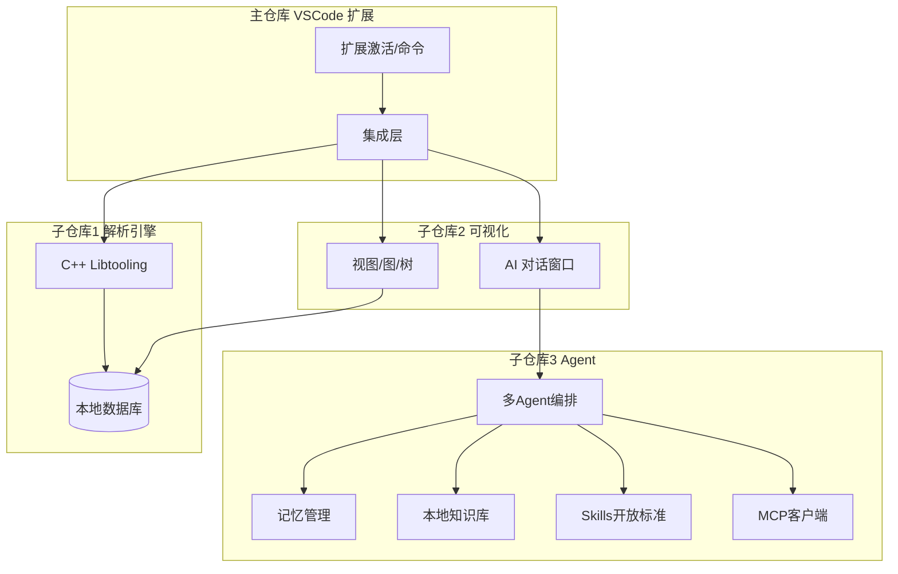

# 系统框架与数据流

## 1. 总览

CodeXray 由**主仓库（VSCode 扩展）**与**三个独立子仓库**组成：

- **主仓库**：VSCode 平台扩展，负责激活、命令/视图、集成三个子组件；支持 Remote-SSH，远程与本地行为一致。
- **子仓库 1**：C/C++ 解析引擎（C++，Clang libtooling），基于 compile_commands.json 解析函数调用链、类关系、全局变量数据流、控制流，并持久化到本地 DB，支持高效查询。
- **子仓库 2**：可视化界面，提供侧边栏 AI 对话与编辑区新标签中的图/树/列表展示（调用链、类图、数据流、控制流）。
- **子仓库 3**：AI Agent 管理模块（Rust），记忆管理、多 Agent 编排、持久化记忆、本地知识库；支持 **Skills 开放标准**（加载与调用技能）与 **MCP 服务**（作为 MCP 客户端连接外部 MCP 服务器，调用 tools/resources）。

主仓库通过子模块或 npm/cargo 依赖引用三个子仓库；扩展运行时由主仓库协调解析引擎、UI 与 Agent 服务。

## 2. 架构图

## 3. 数据流简述

| 场景 | 数据流 |
|------|--------|
| 解析 | 用户选择工程 → 主仓库调用解析引擎 → 解析引擎读 compile_commands.json，写 DB → 主仓库获知完成/失败，刷新 UI |
| 查询与可视化 | 用户发起查询 → 主仓库或解析引擎从 DB 查询 → 结果 JSON 传给编辑区标签中的可视化组件 → 渲染图/树/列表 |
| AI 对话 | 用户在侧边栏输入 → 主仓库带上下文转发给 Agent 服务 → Agent 用记忆与知识库生成回复 → 流式或一次性返回 → 主仓库推送到侧边栏 UI |

## 4. UI 布局与 Remote-SSH

- **AI 对话窗口**：侧边栏（与资源管理器等并列）。
- **可视化展示**：编辑区新建标签（与代码文件标签并列）。
- **Remote-SSH**：扩展在远程扩展主机激活，解析引擎、DB、Agent 在远程主机运行；侧边栏与编辑区标签的 UI 仍在本地 VSCode 前端展示，通过远程通道与后端通信；行为与本地一致。

## 5. 技术选型摘要

| 组件 | 技术选型 |
|------|----------|
| 解析引擎 | C++，Clang libtooling；输入 compile_commands.json；输出写入本地 DB（建议 SQLite），支持高效查询 |
| 主仓库与 UI | TypeScript/JavaScript，VSCode Extension API；侧边栏视图 + 编辑区 Custom Editor/Webview |
| Agent | Rust；记忆与知识库存储（如 SQLite/嵌入式向量库）；本地服务（stdio/socket/HTTP）；Skills 开放标准（技能加载与调用）；MCP 客户端（连接 MCP 服务器、调用 tools/resources） |
| 通信 | 主仓库 ↔ 解析引擎：CLI 或本地 API；主仓库 ↔ Agent：stdio 或 socket/HTTP；主仓库 ↔ UI：VSCode 消息与数据接口 |

更细的接口与 DB 设计见各子模块 doc：`01-解析引擎/`、`02-可视化界面/`、`03-Agent模块/`。
